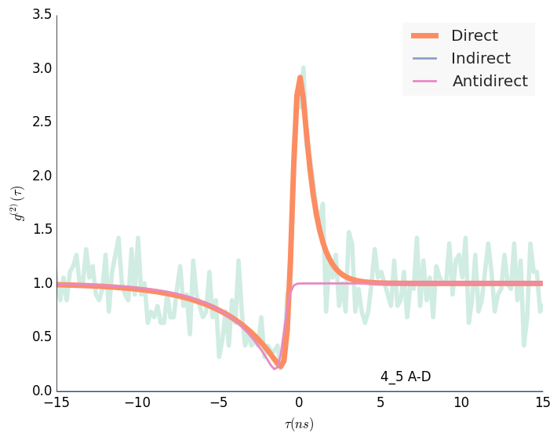
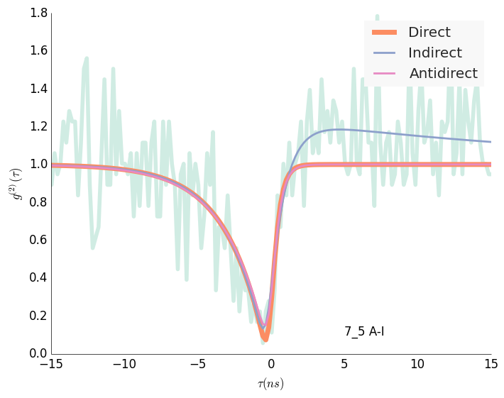

# 1_3 A-I

## Direct
	c1: 0.755 +- 0.116
	l1: 0.330 +- 0.066
	l2: 0.757 +- 0.110
## Indirect
	c1: 1.153 +- 0.527
	l1: 0.391 +- 0.113
	l3: 2.190 +- 1.244
	l2: 1.000 +- 0.211
## Antidirect
	l1: 12.191 +- 0.451
	l2: 1.007 +- 53.915

# 3_5 A-I

## Direct
	c1: -0.941 +- 1.690
	l1: 5.034 +- 7.848
	l2: 0.461 +- 0.086
## Indirect
	c1: 0.457 +- 0.306
	l1: 0.227 +- 0.108
	l3: 1.308 +- 0.580
	l2: 0.507 +- 0.069
## Antidirect
	l1: 5.158 +- 0.074
	l2: 0.462 +- 6.860

# 2_3 A-D

## Direct
	c1: 1.416 +- 0.179
	l1: 0.539 +- 0.088
	l2: 0.836 +- 0.138
## Indirect
	c1: 2.867 +- 2.398
	l1: 0.703 +- 0.245
	l3: 2.192 +- 1.436
	l2: 1.050 +- 0.223
## Antidirect
	l1: 19.291 +- 0.783
	l2: 1.204 +- 161.745

# 1_6 A-D

## Direct
	c1: 2.030 +- 0.229
	l1: 0.757 +- 0.108
	l2: 0.413 +- 0.046
## Indirect
	c1: 2.084 +- 0.801
	l1: 0.758 +- 0.114
	l3: 32.781 +- 419.539
	l2: 0.418 +- 0.080
## Antidirect
	l1: 33.501 +- 0.163
	l2: 0.496 +- 562.448

# 2_6 A-I

## Direct
	c1: -0.772 +- 1.148
	l1: 3.012 +- 3.035
	l2: 0.551 +- 0.127
## Indirect
	c1: 0.246 +- 0.093
	l1: 0.090 +- 0.043
	l3: 1.580 +- 0.645
	l2: 0.594 +- 0.095
## Antidirect
	l1: 3.203 +- 0.105
	l2: 0.569 +- 2.579

# 4_5 A-D

## Direct
	c1: 3.765 +- 0.456
	l1: 1.288 +- 0.192
	l2: 0.304 +- 0.034
## Indirect
	c1: 0.000 +- 0.000
	l1: 0.000 +- 0.000
	l3: 0.000 +- 0.000
	l2: 0.000 +- 0.000
## Antidirect
	l1: 34.591 +- 0.118
	l2: 0.357 +- 826.617

# 1_7 A-D

## Direct
	c1: 3.609 +- 0.344
	l1: 0.787 +- 0.098
	l2: 0.502 +- 0.092
## Indirect
	c1: 3.703 +- 1.887
	l1: 0.787 +- 0.107
	l3: 33.340 +- 587.140
	l2: 0.514 +- 0.157
## Antidirect
	l1: 40.333 +- 1.544
	l2: 1.273 +- 1215.211

# 2_7 A-I

## Direct
	c1: 0.287 +- 0.077
	l1: 0.188 +- 0.067
	l2: 0.796 +- 0.114
## Indirect
	c1: 0.290 +- 0.082
	l1: 0.188 +- 0.068
	l3: 33.013 +- 319.681
	l2: 0.818 +- 0.239
## Antidirect
	l1: 33.230 +- 0.305
	l2: 0.906 +- 317.581

# 3_7 A-A

## Direct
	c1: -0.940 +- 0.306
	l1: 1.044 +- 0.384
	l2: 1.574 +- 0.794
## Indirect
	c1: 0.157 +- 0.147
	l1: 0.059 +- 0.079
	l3: 0.687 +- 0.229
	l2: 2.042 +- 1.082
## Antidirect
	l1: 1.076 +- 0.733
	l2: 1.645 +- 0.335

# 5_7 A-A

## Direct
	c1: -1.162 +- 0.164
	l1: 0.389 +- 0.076
	l2: 2.876 +- 2.567
## Indirect
	c1: 50.369 +- 306674.900
	l1: 0.636 +- 35.563
	l3: 0.625 +- 34.011
	l2: 4.219 +- 6.667
## Antidirect
	l1: 0.352 +- 1.629
	l2: 2.236 +- 0.059

# 6_7 A-A

## Direct
	c1: -0.849 +- 0.310
	l1: 0.733 +- 0.282
	l2: 1.609 +- 1.108
## Indirect
	c1: 0.067 +- 0.095
	l1: -0.006 +- 0.102
	l3: 0.647 +- 0.231
	l2: 2.033 +- 1.374
## Antidirect
	l1: 0.798 +- 1.179
	l2: 1.879 +- 0.245

# 7_5 A-I

## Direct
	c1: -0.000 +- 0.000
	l1: -0.468 +- 0.740
	l2: 31.930 +- 101.566
## Indirect
	c1: 35.002 +- 150398.952
	l1: 26.149 +- 9164.482
	l3: 31.130 +- 12172.069
	l2: 3.307 +- 9.787
## Antidirect
	l1: 31.728 +- 88.694
	l2: 8.089 +- 1296.081
