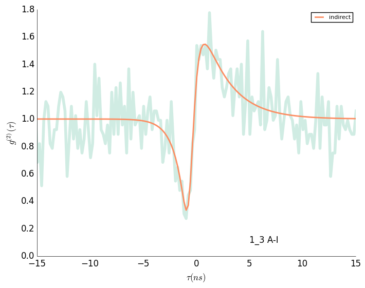
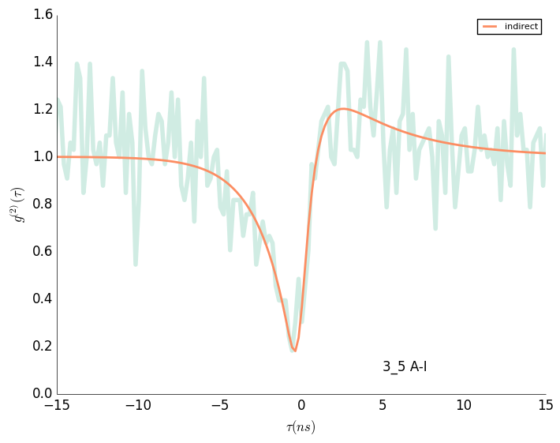

# 1_3 A-I

## Indirect
	c1: 1.153 +- 0.527
	l1: 0.391 +- 0.113
	l3: 2.190 +- 1.244
	l2: 1.000 +- 0.211

# 3_5 A-I

## Indirect
	c1: 0.457 +- 0.306
	l1: 0.227 +- 0.108
	l3: 1.308 +- 0.580
	l2: 0.507 +- 0.069

# 2_3 A-D

## Direct
	c1: 1.416 +- 0.179
	l1: 0.539 +- 0.088
	l2: 0.836 +- 0.138

# 1_6 A-D

## Direct
	c1: 2.030 +- 0.229
	l1: 0.757 +- 0.108
	l2: 0.413 +- 0.046

# 2_6 A-I

## Indirect
	c1: 0.246 +- 0.093
	l1: 0.090 +- 0.043
	l3: 1.580 +- 0.645
	l2: 0.594 +- 0.095

# 4_5 A-D

## Direct
	c1: 3.765 +- 0.456
	l1: 1.288 +- 0.192
	l2: 0.304 +- 0.034

# 1_7 A-D

## Direct
	c1: 3.609 +- 0.344
	l1: 0.787 +- 0.098
	l2: 0.502 +- 0.092

# 2_7 A-I

## Indirect
	c1: 0.290 +- 0.082
	l1: 0.188 +- 0.068
	l3: 33.013 +- 319.681
	l2: 0.818 +- 0.239

# 3_7 A-A

## Antidirect
	l1: 1.076 +- 0.335
	l2: 1.645 +- 0.733

# 5_7 A-A

## Antidirect
	l1: 0.352 +- 0.059
	l2: 2.236 +- 1.629

# 6_7 A-A

## Antidirect
	l1: 0.798 +- 0.245
	l2: 1.879 +- 1.179

# 7_5 A-I

## Indirect
	c1: 0.246 +- 0.113
	l1: 0.047 +- 0.041
	l3: 0.990 +- 0.387
	l2: 0.376 +- 0.058
