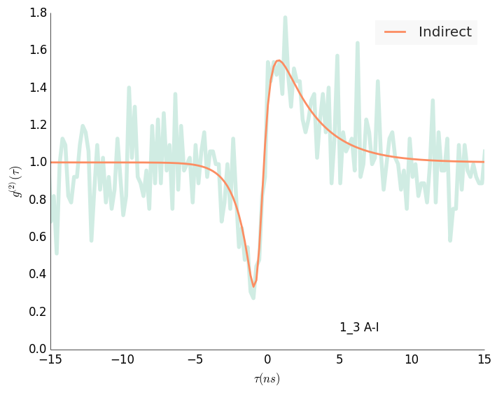
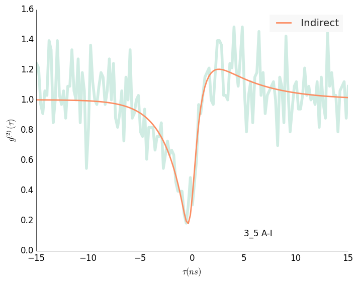
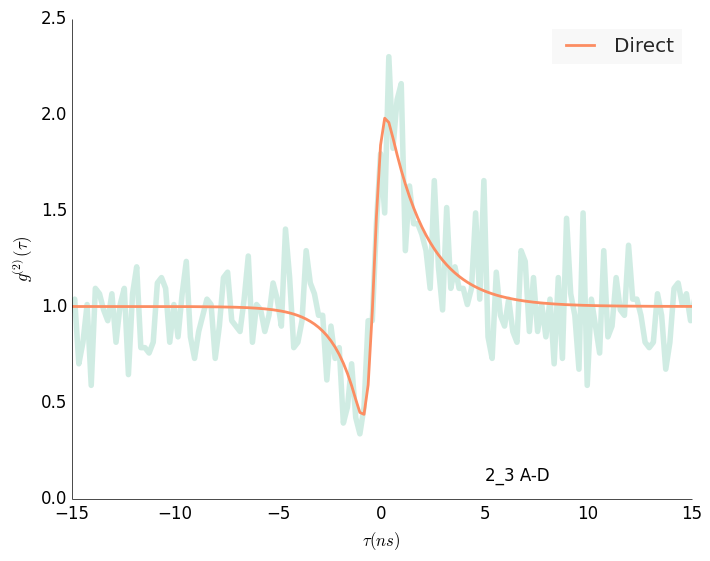
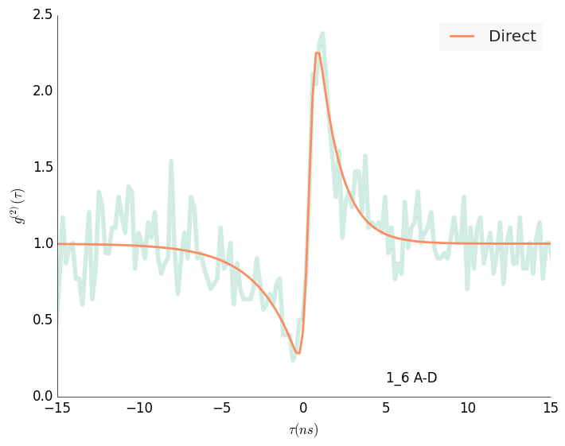
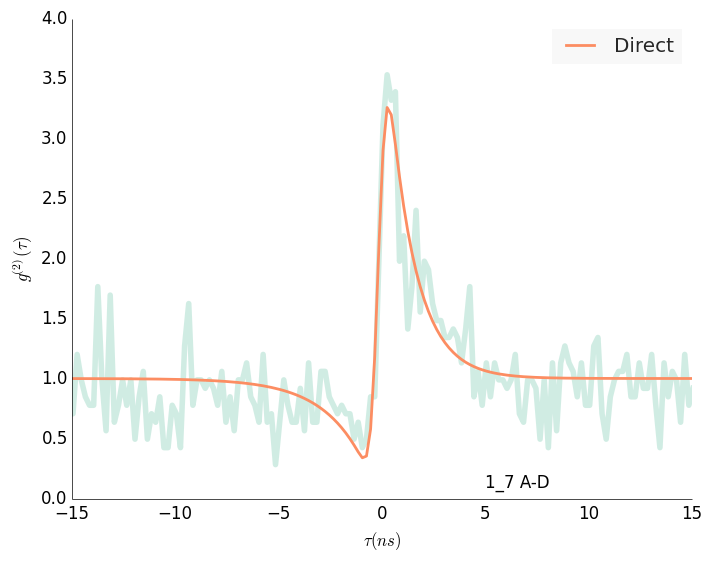
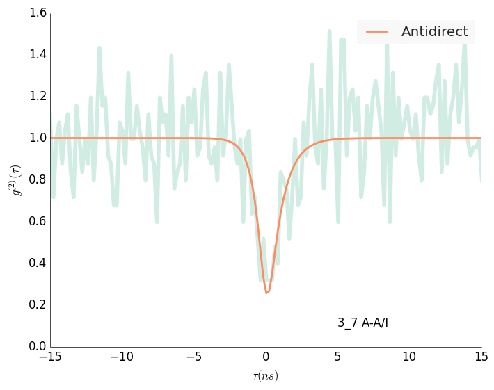
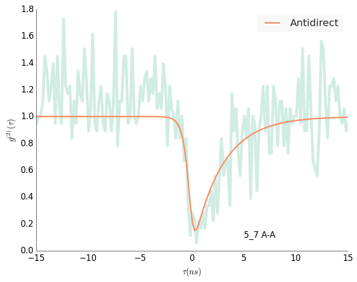
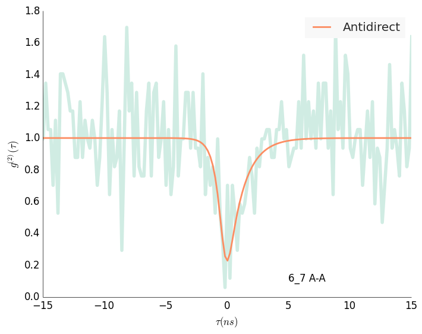

# 1_3 A-I

## Indirect
	c1: 1.103 +- 0.500
	l1: 0.383 +- 0.113
	l3: 2.316 +- 1.414
	l2: 0.991 +- 0.219

# 3_5 A-I

## Indirect
	c1: 0.443 +- 0.300
	l1: 0.222 +- 0.110
	l3: 1.339 +- 0.619
	l2: 0.507 +- 0.072

# 2_3 A-D

## Direct
	c1: 1.456 +- 0.175
	l1: 0.558 +- 0.087
	l2: 0.823 +- 0.129

# 1_6 A-D

## Direct
	c1: 2.032 +- 0.238
	l1: 0.758 +- 0.113
	l2: 0.414 +- 0.048

# 2_6 A-A/I

## Indirect
	c1: 0.244 +- 0.097
	l1: 0.089 +- 0.045
	l3: 1.571 +- 0.669
	l2: 0.596 +- 0.100

# 4_5 A-D

## Direct
	c1: 3.755 +- 0.451
	l1: 1.285 +- 0.190
	l2: 0.304 +- 0.034

# 1_7

## Direct
	c1: 3.635 +- 0.344
	l1: 0.790 +- 0.097
	l2: 0.496 +- 0.089

# 2_7

## Direct
	c1: 0.285 +- 0.077
	l1: 0.186 +- 0.068
	l2: 0.797 +- 0.115

# 3_7

## Antidirect
	l1: 1.048 +- 0.302
	l2: 1.702 +- 0.740

# 5_7

## Antidirect
	l1: 0.355 +- 0.061
	l2: 2.096 +- 1.473

# 6_7

## Antidirect
	l1: 0.813 +- 0.246
	l2: 1.774 +- 1.025
