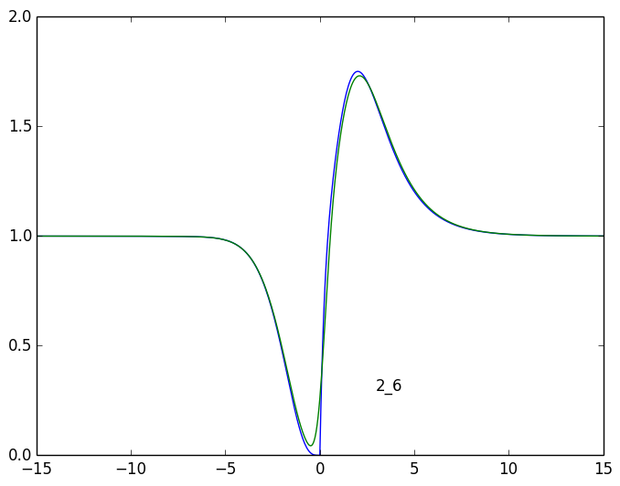

# 1_3

## tau < 0

|  # |            a           |          l            |
|----|------------------------|-----------------------|
|  1 |	      0.4 +      0.0i |	     -5.2 +      0.0i |
|  2 |	     -0.9 +     -0.9i |	     -3.8 +      1.6i |
|  3 |	     -0.9 +      0.9i |	     -3.8 +     -1.6i |
|  4 |	      1.0 +      0.0i |	      0.0 +      0.0i |
|  5 |	      4.5 +     -3.1i |	     -2.9 +      0.4i |
|  6 |	      4.5 +      3.1i |	     -2.9 +     -0.4i |
|  7 |	     -8.3 +     -0.0i |	     -2.0 +      0.0i |
|  8 |	     -1.4 +      0.0i |	     -1.2 +      0.0i |
|  9 |	      0.9 +     -0.0i |	     -1.2 +      0.0i |
| 10 |	      0.0 +      0.0i |	  -1000.0 +      0.0i |
| 11 |	     -0.0 +     -0.0i |	  -1000.0 +      0.0i |

## tau > 0

|  # |            a           |          l            |
|----|------------------------|-----------------------|
|  1 |	     -2.8 +     -0.0i |	     -5.2 +      0.0i |
|  2 |	      0.7 +     -0.6i |	     -3.8 +      1.6i |
|  3 |	      0.7 +      0.6i |	     -3.8 +     -1.6i |
|  4 |	      1.0 +     -0.0i |	      0.0 +      0.0i |
|  5 |	      0.5 +     -1.6i |	     -2.9 +      0.4i |
|  6 |	      0.5 +      1.6i |	     -2.9 +     -0.4i |
|  7 |	     -1.0 +     -0.0i |	     -2.0 +      0.0i |
|  8 |	      0.4 +      0.0i |	     -1.2 +      0.0i |
|  9 |	     -0.2 +     -0.0i |	     -1.2 +      0.0i |
| 10 |	      0.0 +      0.0i |	  -1000.0 +      0.0i |
| 11 |	     -0.0 +     -0.0i |	  -1000.0 +      0.0i |

# 3_5

## tau < 0

|  # |            a           |          l            |
|----|------------------------|-----------------------|
|  1 |	     -0.9 +     -0.0i |	     -5.2 +      0.0i |
|  2 |	      2.1 +      0.1i |	     -3.8 +      1.6i |
|  3 |	      2.1 +     -0.1i |	     -3.8 +     -1.6i |
|  4 |	      1.0 +      0.0i |	      0.0 +      0.0i |
|  5 |	     -2.9 +      4.3i |	     -2.9 +      0.4i |
|  6 |	     -2.9 +     -4.3i |	     -2.9 +     -0.4i |
|  7 |	      0.8 +      0.0i |	     -2.0 +      0.0i |
|  8 |	      1.1 +     -0.0i |	     -1.2 +      0.0i |
|  9 |	     -0.4 +      0.0i |	     -1.2 +      0.0i |
| 10 |	     -0.0 +     -0.0i |	  -1000.0 +      0.0i |
| 11 |	      0.0 +      0.0i |	  -1000.0 +      0.0i |

## tau > 0

|  # |            a           |          l            |
|----|------------------------|-----------------------|
|  1 |	      0.1 +      0.0i |	     -5.2 +      0.0i |
|  2 |	     -1.9 +     -2.9i |	     -3.8 +      1.6i |
|  3 |	     -1.9 +      2.9i |	     -3.8 +     -1.6i |
|  4 |	      1.0 +      0.0i |	      0.0 +      0.0i |
|  5 |	     -0.6 +      1.2i |	     -2.9 +      0.4i |
|  6 |	     -0.6 +     -1.2i |	     -2.9 +     -0.4i |
|  7 |	      3.7 +      0.0i |	     -2.0 +      0.0i |
|  8 |	      0.6 +     -0.0i |	     -1.2 +      0.0i |
|  9 |	     -0.3 +      0.0i |	     -1.2 +      0.0i |
| 10 |	      0.0 +      0.0i |	  -1000.0 +      0.0i |
| 11 |	     -0.0 +     -0.0i |	  -1000.0 +      0.0i |

# 2_3

## tau < 0

|  # |            a           |          l            |
|----|------------------------|-----------------------|
|  1 |	      0.4 +      0.0i |	     -5.2 +      0.0i |
|  2 |	     -0.9 +     -0.9i |	     -3.8 +      1.6i |
|  3 |	     -0.9 +      0.9i |	     -3.8 +     -1.6i |
|  4 |	      1.0 +      0.0i |	      0.0 +      0.0i |
|  5 |	      4.5 +     -3.1i |	     -2.9 +      0.4i |
|  6 |	      4.5 +      3.1i |	     -2.9 +     -0.4i |
|  7 |	     -8.3 +     -0.0i |	     -2.0 +      0.0i |
|  8 |	     -1.4 +      0.0i |	     -1.2 +      0.0i |
|  9 |	      0.9 +     -0.0i |	     -1.2 +      0.0i |
| 10 |	      0.0 +      0.0i |	  -1000.0 +      0.0i |
| 11 |	     -0.0 +     -0.0i |	  -1000.0 +      0.0i |

## tau > 0

|  # |            a           |          l            |
|----|------------------------|-----------------------|
|  1 |	      1.0 +      0.0i |	     -5.2 +      0.0i |
|  2 |	      0.5 +     -0.1i |	     -3.8 +      1.6i |
|  3 |	      0.5 +      0.1i |	     -3.8 +     -1.6i |
|  4 |	      1.0 +     -0.0i |	      0.0 +      0.0i |
|  5 |	      0.8 +     -1.0i |	     -2.9 +      0.4i |
|  6 |	      0.8 +      1.0i |	     -2.9 +     -0.4i |
|  7 |	      0.1 +     -0.0i |	     -2.0 +      0.0i |
|  8 |	     -0.2 +      0.0i |	     -1.2 +      0.0i |
|  9 |	      0.0 +     -0.0i |	     -1.2 +      0.0i |
| 10 |	     -4.7 +      0.0i |	  -1000.0 +      0.0i |
| 11 |	      0.0 +     -0.0i |	  -1000.0 +      0.0i |

# 1_6

## tau < 0

|  # |            a           |          l            |
|----|------------------------|-----------------------|
|  1 |	      0.4 +      0.0i |	     -5.2 +      0.0i |
|  2 |	     -0.9 +     -0.9i |	     -3.8 +      1.6i |
|  3 |	     -0.9 +      0.9i |	     -3.8 +     -1.6i |
|  4 |	      1.0 +      0.0i |	      0.0 +      0.0i |
|  5 |	      4.5 +     -3.1i |	     -2.9 +      0.4i |
|  6 |	      4.5 +      3.1i |	     -2.9 +     -0.4i |
|  7 |	     -8.3 +     -0.0i |	     -2.0 +      0.0i |
|  8 |	     -1.4 +      0.0i |	     -1.2 +      0.0i |
|  9 |	      0.9 +     -0.0i |	     -1.2 +      0.0i |
| 10 |	      0.0 +      0.0i |	  -1000.0 +      0.0i |
| 11 |	     -0.0 +     -0.0i |	  -1000.0 +      0.0i |

## tau > 0

|  # |            a           |          l            |
|----|------------------------|-----------------------|
|  1 |	      9.2 +      0.0i |	     -5.2 +      0.0i |
|  2 |	     -0.0 +     -1.3i |	     -3.8 +      1.6i |
|  3 |	     -0.0 +      1.3i |	     -3.8 +     -1.6i |
|  4 |	      1.0 +     -0.0i |	      0.0 +      0.0i |
|  5 |	      1.3 +      0.9i |	     -2.9 +      0.4i |
|  6 |	      1.3 +     -0.9i |	     -2.9 +     -0.4i |
|  7 |	      0.2 +      0.0i |	     -2.0 +      0.0i |
|  8 |	     -0.9 +     -0.0i |	     -1.2 +      0.0i |
|  9 |	      0.3 +      0.0i |	     -1.2 +      0.0i |
| 10 |	     -0.0 +     -0.0i |	  -1000.0 +      0.0i |
| 11 |	      0.0 +      0.0i |	  -1000.0 +      0.0i |

# 2_6

## tau < 0

|  # |            a           |          l            |
|----|------------------------|-----------------------|
|  1 |	      0.4 +      0.0i |	     -5.2 +      0.0i |
|  2 |	     -0.9 +     -0.9i |	     -3.8 +      1.6i |
|  3 |	     -0.9 +      0.9i |	     -3.8 +     -1.6i |
|  4 |	      1.0 +      0.0i |	      0.0 +      0.0i |
|  5 |	      4.5 +     -3.1i |	     -2.9 +      0.4i |
|  6 |	      4.5 +      3.1i |	     -2.9 +     -0.4i |
|  7 |	     -8.3 +     -0.0i |	     -2.0 +      0.0i |
|  8 |	     -1.4 +      0.0i |	     -1.2 +      0.0i |
|  9 |	      0.9 +     -0.0i |	     -1.2 +      0.0i |
| 10 |	      0.0 +      0.0i |	  -1000.0 +      0.0i |
| 11 |	     -0.0 +     -0.0i |	  -1000.0 +      0.0i |

## tau > 0

|  # |            a           |          l            |
|----|------------------------|-----------------------|
|  1 |	     -3.4 +     -0.0i |	     -5.2 +      0.0i |
|  2 |	      0.3 +     -0.8i |	     -3.8 +      1.6i |
|  3 |	      0.3 +      0.8i |	     -3.8 +     -1.6i |
|  4 |	      1.0 +     -0.0i |	      0.0 +      0.0i |
|  5 |	      0.7 +      0.9i |	     -2.9 +      0.4i |
|  6 |	      0.7 +     -0.9i |	     -2.9 +     -0.4i |
|  7 |	     -0.0 +      0.0i |	     -2.0 +      0.0i |
|  8 |	      0.3 +     -0.0i |	     -1.2 +      0.0i |
|  9 |	     -0.1 +      0.0i |	     -1.2 +      0.0i |
| 10 |	      0.0 +     -0.0i |	  -1000.0 +      0.0i |
| 11 |	     -0.0 +      0.0i |	  -1000.0 +      0.0i |

# 4_5

## tau < 0

|  # |            a           |          l            |
|----|------------------------|-----------------------|
|  1 |	      2.1 +      0.0i |	     -5.2 +      0.0i |
|  2 |	     -0.3 +     -4.8i |	     -3.8 +      1.6i |
|  3 |	     -0.3 +      4.8i |	     -3.8 +     -1.6i |
|  4 |	      1.0 +      0.0i |	      0.0 +      0.0i |
|  5 |	     -2.7 +     24.6i |	     -2.9 +      0.4i |
|  6 |	     -2.7 +    -24.6i |	     -2.9 +     -0.4i |
|  7 |	      1.8 +      0.0i |	     -2.0 +      0.0i |
|  8 |	      1.6 +     -0.0i |	     -1.2 +      0.0i |
|  9 |	     -0.6 +      0.0i |	     -1.2 +      0.0i |
| 10 |	      0.0 +      0.0i |	  -1000.0 +      0.0i |
| 11 |	     -0.0 +     -0.0i |	  -1000.0 +      0.0i |

## tau > 0

|  # |            a           |          l            |
|----|------------------------|-----------------------|
|  1 |	     -0.2 +      0.0i |	     -5.2 +      0.0i |
|  2 |	      2.8 +      0.3i |	     -3.8 +      1.6i |
|  3 |	      2.8 +     -0.3i |	     -3.8 +     -1.6i |
|  4 |	      1.0 +     -0.0i |	      0.0 +      0.0i |
|  5 |	     -0.1 +     -0.3i |	     -2.9 +      0.4i |
|  6 |	     -0.1 +      0.3i |	     -2.9 +     -0.4i |
|  7 |	      0.7 +     -0.0i |	     -2.0 +      0.0i |
|  8 |	      0.3 +      0.0i |	     -1.2 +      0.0i |
|  9 |	     -0.1 +      0.0i |	     -1.2 +      0.0i |
| 10 |	     -0.0 +      0.0i |	  -1000.0 +      0.0i |
| 11 |	     -0.0 +     -0.0i |	  -1000.0 +      0.0i |

# 1_7

## tau < 0

|  # |            a           |          l            |
|----|------------------------|-----------------------|
|  1 |	      0.1 +     -0.0i |	     -5.2 +      0.0i |
|  2 |	     -0.4 +     -0.2i |	     -3.8 +      1.6i |
|  3 |	     -0.4 +      0.2i |	     -3.8 +     -1.6i |
|  4 |	      1.0 +      0.0i |	      0.0 +      0.0i |
|  5 |	      0.4 +     -0.8i |	     -2.9 +      0.4i |
|  6 |	      0.4 +      0.8i |	     -2.9 +     -0.4i |
|  7 |	      2.4 +     -0.0i |	     -2.0 +      0.0i |
|  8 |	     -5.1 +      0.0i |	     -1.2 +      0.0i |
|  9 |	      1.5 +      0.0i |	     -1.2 +      0.0i |
| 10 |	     -0.0 +     -0.0i |	  -1000.0 +      0.0i |
| 11 |	      0.0 +      0.0i |	  -1000.0 +      0.0i |

## tau > 0

|  # |            a           |          l            |
|----|------------------------|-----------------------|
|  1 |	      9.2 +      0.0i |	     -5.2 +      0.0i |
|  2 |	     -0.0 +     -1.3i |	     -3.8 +      1.6i |
|  3 |	     -0.0 +      1.3i |	     -3.8 +     -1.6i |
|  4 |	      1.0 +     -0.0i |	      0.0 +      0.0i |
|  5 |	      1.3 +      0.9i |	     -2.9 +      0.4i |
|  6 |	      1.3 +     -0.9i |	     -2.9 +     -0.4i |
|  7 |	      0.2 +      0.0i |	     -2.0 +      0.0i |
|  8 |	     -0.9 +     -0.0i |	     -1.2 +      0.0i |
|  9 |	      0.3 +      0.0i |	     -1.2 +      0.0i |
| 10 |	     -0.0 +     -0.0i |	  -1000.0 +      0.0i |
| 11 |	      0.0 +      0.0i |	  -1000.0 +      0.0i |

# 2_7

## tau < 0

|  # |            a           |          l            |
|----|------------------------|-----------------------|
|  1 |	      0.1 +     -0.0i |	     -5.2 +      0.0i |
|  2 |	     -0.4 +     -0.2i |	     -3.8 +      1.6i |
|  3 |	     -0.4 +      0.2i |	     -3.8 +     -1.6i |
|  4 |	      1.0 +      0.0i |	      0.0 +      0.0i |
|  5 |	      0.4 +     -0.8i |	     -2.9 +      0.4i |
|  6 |	      0.4 +      0.8i |	     -2.9 +     -0.4i |
|  7 |	      2.4 +     -0.0i |	     -2.0 +      0.0i |
|  8 |	     -5.1 +      0.0i |	     -1.2 +      0.0i |
|  9 |	      1.5 +      0.0i |	     -1.2 +      0.0i |
| 10 |	     -0.0 +     -0.0i |	  -1000.0 +      0.0i |
| 11 |	      0.0 +      0.0i |	  -1000.0 +      0.0i |

## tau > 0

|  # |            a           |          l            |
|----|------------------------|-----------------------|
|  1 |	     -3.4 +     -0.0i |	     -5.2 +      0.0i |
|  2 |	      0.3 +     -0.8i |	     -3.8 +      1.6i |
|  3 |	      0.3 +      0.8i |	     -3.8 +     -1.6i |
|  4 |	      1.0 +     -0.0i |	      0.0 +      0.0i |
|  5 |	      0.7 +      0.9i |	     -2.9 +      0.4i |
|  6 |	      0.7 +     -0.9i |	     -2.9 +     -0.4i |
|  7 |	     -0.0 +      0.0i |	     -2.0 +      0.0i |
|  8 |	      0.3 +     -0.0i |	     -1.2 +      0.0i |
|  9 |	     -0.1 +      0.0i |	     -1.2 +      0.0i |
| 10 |	      0.0 +     -0.0i |	  -1000.0 +      0.0i |
| 11 |	     -0.0 +      0.0i |	  -1000.0 +      0.0i |

# 3_7

## tau < 0

|  # |            a           |          l            |
|----|------------------------|-----------------------|
|  1 |	      0.3 +     -0.0i |	     -5.2 +      0.0i |
|  2 |	     -0.0 +      0.7i |	     -3.8 +      1.6i |
|  3 |	     -0.0 +     -0.7i |	     -3.8 +     -1.6i |
|  4 |	      1.0 +      0.0i |	      0.0 +      0.0i |
|  5 |	     -0.3 +      0.3i |	     -2.9 +      0.4i |
|  6 |	     -0.3 +     -0.3i |	     -2.9 +     -0.4i |
|  7 |	     -1.2 +      0.0i |	     -2.0 +      0.0i |
|  8 |	      0.9 +     -0.0i |	     -1.2 +      0.0i |
|  9 |	     -0.3 +     -0.0i |	     -1.2 +      0.0i |
| 10 |	     -0.0 +     -0.0i |	  -1000.0 +      0.0i |
| 11 |	      0.0 +      0.0i |	  -1000.0 +      0.0i |

## tau > 0

|  # |            a           |          l            |
|----|------------------------|-----------------------|
|  1 |	     -2.8 +     -0.0i |	     -5.2 +      0.0i |
|  2 |	      1.5 +      2.4i |	     -3.8 +      1.6i |
|  3 |	      1.5 +     -2.4i |	     -3.8 +     -1.6i |
|  4 |	      1.0 +      0.0i |	      0.0 +      0.0i |
|  5 |	     -0.1 +     -2.3i |	     -2.9 +      0.4i |
|  6 |	     -0.1 +      2.3i |	     -2.9 +     -0.4i |
|  7 |	     -0.8 +     -0.0i |	     -2.0 +      0.0i |
|  8 |	     -0.5 +      0.0i |	     -1.2 +      0.0i |
|  9 |	      0.3 +     -0.0i |	     -1.2 +      0.0i |
| 10 |	     -0.0 +     -0.0i |	  -1000.0 +      0.0i |
| 11 |	      0.0 +      0.0i |	  -1000.0 +      0.0i |

# 5_7

## tau < 0

|  # |            a           |          l            |
|----|------------------------|-----------------------|
|  1 |	      0.0 +     -0.0i |	     -5.2 +      0.0i |
|  2 |	     -1.0 +     -0.7i |	     -3.8 +      1.6i |
|  3 |	     -1.0 +      0.7i |	     -3.8 +     -1.6i |
|  4 |	      1.0 +      0.0i |	      0.0 +      0.0i |
|  5 |	     -0.0 +      0.2i |	     -2.9 +      0.4i |
|  6 |	     -0.0 +     -0.2i |	     -2.9 +     -0.4i |
|  7 |	     -1.1 +      0.0i |	     -2.0 +      0.0i |
|  8 |	      2.4 +     -0.0i |	     -1.2 +      0.0i |
|  9 |	     -0.5 +     -0.0i |	     -1.2 +      0.0i |
| 10 |	     -0.0 +     -0.0i |	  -1000.0 +      0.0i |
| 11 |	      0.0 +      0.0i |	  -1000.0 +      0.0i |

## tau > 0

|  # |            a           |          l            |
|----|------------------------|-----------------------|
|  1 |	      3.1 +      0.0i |	     -5.2 +      0.0i |
|  2 |	      2.0 +     -2.5i |	     -3.8 +      1.6i |
|  3 |	      2.0 +      2.5i |	     -3.8 +     -1.6i |
|  4 |	      1.0 +      0.0i |	      0.0 +      0.0i |
|  5 |	     -3.2 +     -3.6i |	     -2.9 +      0.4i |
|  6 |	     -3.2 +      3.6i |	     -2.9 +     -0.4i |
|  7 |	     -0.1 +     -0.0i |	     -2.0 +      0.0i |
|  8 |	     -2.2 +      0.0i |	     -1.2 +      0.0i |
|  9 |	      0.7 +     -0.0i |	     -1.2 +      0.0i |
| 10 |	      0.0 +      0.0i |	  -1000.0 +      0.0i |
| 11 |	     -0.0 +     -0.0i |	  -1000.0 +      0.0i |

# 6_7

## tau < 0

|  # |            a           |          l            |
|----|------------------------|-----------------------|
|  1 |	     -1.0 +      0.0i |	     -5.2 +      0.0i |
|  2 |	      0.7 +      0.6i |	     -3.8 +      1.6i |
|  3 |	      0.7 +     -0.6i |	     -3.8 +     -1.6i |
|  4 |	      1.0 +      0.0i |	      0.0 +      0.0i |
|  5 |	     -0.2 +     -0.3i |	     -2.9 +      0.4i |
|  6 |	     -0.2 +      0.3i |	     -2.9 +     -0.4i |
|  7 |	      0.2 +     -0.0i |	     -2.0 +      0.0i |
|  8 |	     -1.9 +      0.0i |	     -1.2 +      0.0i |
|  9 |	      0.5 +      0.0i |	     -1.2 +      0.0i |
| 10 |	      0.0 +      0.0i |	  -1000.0 +      0.0i |
| 11 |	     -0.0 +     -0.0i |	  -1000.0 +      0.0i |

## tau > 0

|  # |            a           |          l            |
|----|------------------------|-----------------------|
|  1 |	     -2.8 +     -0.0i |	     -5.2 +      0.0i |
|  2 |	      1.5 +      2.4i |	     -3.8 +      1.6i |
|  3 |	      1.5 +     -2.4i |	     -3.8 +     -1.6i |
|  4 |	      1.0 +      0.0i |	      0.0 +      0.0i |
|  5 |	     -0.1 +     -2.3i |	     -2.9 +      0.4i |
|  6 |	     -0.1 +      2.3i |	     -2.9 +     -0.4i |
|  7 |	     -0.8 +     -0.0i |	     -2.0 +      0.0i |
|  8 |	     -0.5 +      0.0i |	     -1.2 +      0.0i |
|  9 |	      0.3 +     -0.0i |	     -1.2 +      0.0i |
| 10 |	     -0.0 +     -0.0i |	  -1000.0 +      0.0i |
| 11 |	      0.0 +      0.0i |	  -1000.0 +      0.0i |

