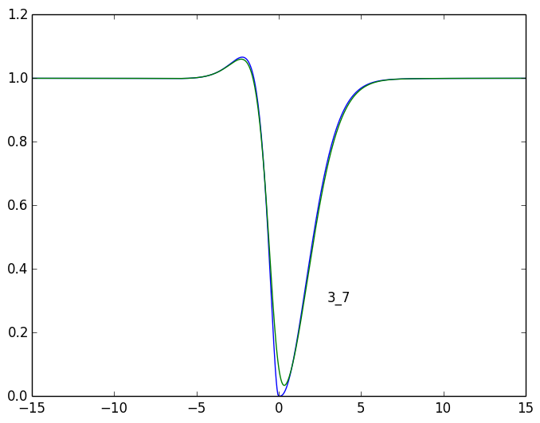

# 1_3

## tau > 0
	  1 | a:    0.229 +   -0.522i 	 l:   -3.810 +    1.660i
	  2 | a:    0.229 +    0.522i 	 l:   -3.810 +   -1.660i
	  3 | a:    1.000 +    0.000i 	 l:    0.000 +    0.000i
	  5 | a:    0.560 +    0.250i 	 l:   -2.645 +    0.168i
	  6 | a:    0.560 +   -0.250i 	 l:   -2.645 +   -0.168i
	  8 | a:   -1.311 +    0.697i 	 l:   -1.276 +   -0.703i
## tau < 0
	  2 | a:   -1.113 +    0.591i 	 l:   -3.810 +   -1.660i
	  3 | a:    1.000 +   -0.000i 	 l:    0.000 +    0.000i
	  5 | a:    2.314 +    7.699i 	 l:   -2.645 +    0.168i
	  6 | a:    2.314 +   -7.699i 	 l:   -2.645 +   -0.168i
	  7 | a:   -1.597 +    0.202i 	 l:   -1.276 +    0.703i

# 3_5

## tau > 0
	  2 | a:   -1.878 +    2.789i 	 l:   -3.810 +   -1.660i
	  3 | a:    1.000 +   -0.000i 	 l:    0.000 +    0.000i
	  5 | a:    0.356 +    2.026i 	 l:   -2.645 +    0.168i
	  6 | a:    0.356 +   -2.026i 	 l:   -2.645 +   -0.168i
	  7 | a:    0.936 +   -0.158i 	 l:   -1.276 +    0.703i
	  8 | a:    0.936 +    0.158i 	 l:   -1.276 +   -0.703i
	  9 | a:    0.172 +    0.000i 	 l:   -1.264 +    0.000i
## tau < 0
	  1 | a:    2.188 +   -0.565i 	 l:   -3.810 +    1.660i
	  2 | a:    2.188 +    0.565i 	 l:   -3.810 +   -1.660i
	  3 | a:    1.000 +   -0.000i 	 l:    0.000 +    0.000i
	  4 | a:    1.063 +    0.000i 	 l:   -3.483 +    0.000i
	  6 | a:   -2.643 +    4.520i 	 l:   -2.645 +   -0.168i
	  8 | a:   -0.579 +    1.089i 	 l:   -1.276 +   -0.703i

# 2_3

## tau > 0
	  1 | a:    0.626 +   -0.376i 	 l:   -3.810 +    1.660i
	  2 | a:    0.626 +    0.376i 	 l:   -3.810 +   -1.660i
	  3 | a:    1.000 +   -0.000i 	 l:    0.000 +    0.000i
	  5 | a:    0.685 +    1.144i 	 l:   -2.645 +    0.168i
	  6 | a:    0.685 +   -1.144i 	 l:   -2.645 +   -0.168i
	  7 | a:    0.539 +    0.235i 	 l:   -1.276 +    0.703i
	  8 | a:    0.539 +   -0.235i 	 l:   -1.276 +   -0.703i
## tau < 0
	  2 | a:   -1.113 +    0.591i 	 l:   -3.810 +   -1.660i
	  3 | a:    1.000 +   -0.000i 	 l:    0.000 +    0.000i
	  5 | a:    2.314 +    7.699i 	 l:   -2.645 +    0.168i
	  6 | a:    2.314 +   -7.699i 	 l:   -2.645 +   -0.168i
	  7 | a:   -1.597 +    0.202i 	 l:   -1.276 +    0.703i

# 1_6

## tau > 0
	  2 | a:   -0.062 +    0.245i 	 l:   -3.810 +   -1.660i
	  3 | a:    1.000 +    0.000i 	 l:    0.000 +    0.000i
	  4 | a:    0.649 +   -0.000i 	 l:   -3.483 +    0.000i
	  5 | a:    3.153 +    2.492i 	 l:   -2.645 +    0.168i
	  6 | a:    3.153 +   -2.492i 	 l:   -2.645 +   -0.168i
	  7 | a:    3.050 +    2.673i 	 l:   -1.276 +    0.703i
	  8 | a:    3.050 +   -2.673i 	 l:   -1.276 +   -0.703i
## tau < 0
	  2 | a:   -1.113 +    0.591i 	 l:   -3.810 +   -1.660i
	  3 | a:    1.000 +   -0.000i 	 l:    0.000 +    0.000i
	  5 | a:    2.314 +    7.699i 	 l:   -2.645 +    0.168i
	  6 | a:    2.314 +   -7.699i 	 l:   -2.645 +   -0.168i
	  7 | a:   -1.597 +    0.202i 	 l:   -1.276 +    0.703i

# 2_6

## tau > 0
	  1 | a:    0.117 +   -0.302i 	 l:   -3.810 +    1.660i
	  2 | a:    0.117 +    0.302i 	 l:   -3.810 +   -1.660i
	  3 | a:    1.000 +   -0.000i 	 l:    0.000 +    0.000i
	  5 | a:    2.500 +    8.368i 	 l:   -2.645 +    0.168i
	  6 | a:    2.500 +   -8.368i 	 l:   -2.645 +   -0.168i
	  8 | a:   -1.286 +    0.963i 	 l:   -1.276 +   -0.703i
## tau < 0
	  2 | a:   -1.113 +    0.591i 	 l:   -3.810 +   -1.660i
	  3 | a:    1.000 +   -0.000i 	 l:    0.000 +    0.000i
	  5 | a:    2.314 +    7.699i 	 l:   -2.645 +    0.168i
	  6 | a:    2.314 +   -7.699i 	 l:   -2.645 +   -0.168i
	  7 | a:   -1.597 +    0.202i 	 l:   -1.276 +    0.703i

# 4_5

## tau > 0
	  1 | a:    2.835 +    0.214i 	 l:   -3.810 +    1.660i
	  2 | a:    2.835 +   -0.214i 	 l:   -3.810 +   -1.660i
	  3 | a:    1.000 +    0.000i 	 l:    0.000 +    0.000i
	  7 | a:    0.503 +    0.186i 	 l:   -1.276 +    0.703i
	  8 | a:    0.503 +   -0.186i 	 l:   -1.276 +   -0.703i
## tau < 0
	  2 | a:   -1.774 +    4.548i 	 l:   -3.810 +   -1.660i
	  3 | a:    1.000 +   -0.000i 	 l:    0.000 +    0.000i
	  4 | a:   29.973 +    0.000i 	 l:   -3.483 +    0.000i
	  6 | a:  -12.431 +   14.734i 	 l:   -2.645 +   -0.168i
	  8 | a:   -1.286 +    1.296i 	 l:   -1.276 +   -0.703i

# 1_7

## tau > 0
	  2 | a:   -0.062 +    0.245i 	 l:   -3.810 +   -1.660i
	  3 | a:    1.000 +    0.000i 	 l:    0.000 +    0.000i
	  4 | a:    0.649 +   -0.000i 	 l:   -3.483 +    0.000i
	  5 | a:    3.153 +    2.492i 	 l:   -2.645 +    0.168i
	  6 | a:    3.153 +   -2.492i 	 l:   -2.645 +   -0.168i
	  7 | a:    3.050 +    2.673i 	 l:   -1.276 +    0.703i
	  8 | a:    3.050 +   -2.673i 	 l:   -1.276 +   -0.703i
## tau < 0
	  3 | a:    1.000 +   -0.000i 	 l:    0.000 +    0.000i
	  5 | a:    0.539 +    0.293i 	 l:   -2.645 +    0.168i
	  6 | a:    0.539 +   -0.293i 	 l:   -2.645 +   -0.168i
	  7 | a:   -0.597 +    1.556i 	 l:   -1.276 +    0.703i

# 2_7

## tau > 0
	  1 | a:    0.117 +   -0.302i 	 l:   -3.810 +    1.660i
	  2 | a:    0.117 +    0.302i 	 l:   -3.810 +   -1.660i
	  3 | a:    1.000 +   -0.000i 	 l:    0.000 +    0.000i
	  5 | a:    2.500 +    8.368i 	 l:   -2.645 +    0.168i
	  6 | a:    2.500 +   -8.368i 	 l:   -2.645 +   -0.168i
	  8 | a:   -1.286 +    0.963i 	 l:   -1.276 +   -0.703i
## tau < 0
	  3 | a:    1.000 +   -0.000i 	 l:    0.000 +    0.000i
	  5 | a:    0.539 +    0.293i 	 l:   -2.645 +    0.168i
	  6 | a:    0.539 +   -0.293i 	 l:   -2.645 +   -0.168i
	  7 | a:   -0.597 +    1.556i 	 l:   -1.276 +    0.703i

# 3_7

## tau > 0
	  1 | a:    0.500 +    0.768i 	 l:   -3.810 +    1.660i
	  2 | a:    0.500 +   -0.768i 	 l:   -3.810 +   -1.660i
	  3 | a:    1.000 +   -0.000i 	 l:    0.000 +    0.000i
	  4 | a:    0.201 +    0.000i 	 l:   -3.483 +    0.000i
	  5 | a:    0.810 +  -26.149i 	 l:   -2.645 +    0.168i
	  6 | a:    0.810 +   26.149i 	 l:   -2.645 +   -0.168i
	  7 | a:   -1.848 +    1.637i 	 l:   -1.276 +    0.703i
## tau < 0
	  1 | a:    0.175 +    0.703i 	 l:   -3.810 +    1.660i
	  2 | a:    0.175 +   -0.703i 	 l:   -3.810 +   -1.660i
	  3 | a:    1.000 +   -0.000i 	 l:    0.000 +    0.000i
	  6 | a:   -0.256 +    0.165i 	 l:   -2.645 +   -0.168i
	  8 | a:   -0.419 +    0.837i 	 l:   -1.276 +   -0.703i

# 5_7

## tau > 0
	  1 | a:    0.614 +   -0.794i 	 l:   -3.810 +    1.660i
	  2 | a:    0.614 +    0.794i 	 l:   -3.810 +   -1.660i
	  3 | a:    1.000 +   -0.000i 	 l:    0.000 +    0.000i
	  4 | a:   15.055 +    0.000i 	 l:   -3.483 +    0.000i
	  6 | a:   -9.479 +   32.973i 	 l:   -2.645 +   -0.168i
	  7 | a:    0.859 +    3.257i 	 l:   -1.276 +    0.703i
	  8 | a:    0.859 +   -3.257i 	 l:   -1.276 +   -0.703i
## tau < 0
	  2 | a:   -0.939 +    0.716i 	 l:   -3.810 +   -1.660i
	  3 | a:    1.000 +   -0.000i 	 l:    0.000 +    0.000i
	  5 | a:    0.128 +    0.091i 	 l:   -2.645 +    0.168i
	  6 | a:    0.128 +   -0.091i 	 l:   -2.645 +   -0.168i
	  7 | a:    0.314 +   -0.931i 	 l:   -1.276 +    0.703i
	  8 | a:    0.314 +    0.931i 	 l:   -1.276 +   -0.703i

# 6_7

## tau > 0
	  1 | a:    0.500 +    0.768i 	 l:   -3.810 +    1.660i
	  2 | a:    0.500 +   -0.768i 	 l:   -3.810 +   -1.660i
	  3 | a:    1.000 +   -0.000i 	 l:    0.000 +    0.000i
	  4 | a:    0.201 +    0.000i 	 l:   -3.483 +    0.000i
	  5 | a:    0.810 +  -26.149i 	 l:   -2.645 +    0.168i
	  6 | a:    0.810 +   26.149i 	 l:   -2.645 +   -0.168i
	  7 | a:   -1.848 +    1.637i 	 l:   -1.276 +    0.703i
## tau < 0
	  1 | a:    0.253 +    0.199i 	 l:   -3.810 +    1.660i
	  2 | a:    0.253 +   -0.199i 	 l:   -3.810 +   -1.660i
	  3 | a:    1.000 +   -0.000i 	 l:    0.000 +    0.000i
	  6 | a:   -1.359 +    1.461i 	 l:   -2.645 +   -0.168i
	  7 | a:    0.590 +    2.487i 	 l:   -1.276 +    0.703i
	  8 | a:    0.590 +   -2.487i 	 l:   -1.276 +   -0.703i

# 7_5

## tau > 0
	  2 | a:   -0.939 +    0.716i 	 l:   -3.810 +   -1.660i
	  3 | a:    1.000 +   -0.000i 	 l:    0.000 +    0.000i
	  5 | a:    0.128 +    0.091i 	 l:   -2.645 +    0.168i
	  6 | a:    0.128 +   -0.091i 	 l:   -2.645 +   -0.168i
	  7 | a:    0.314 +   -0.931i 	 l:   -1.276 +    0.703i
	  8 | a:    0.314 +    0.931i 	 l:   -1.276 +   -0.703i
## tau < 0
	  1 | a:    0.614 +   -0.794i 	 l:   -3.810 +    1.660i
	  2 | a:    0.614 +    0.794i 	 l:   -3.810 +   -1.660i
	  3 | a:    1.000 +   -0.000i 	 l:    0.000 +    0.000i
	  4 | a:   15.055 +    0.000i 	 l:   -3.483 +    0.000i
	  6 | a:   -9.479 +   32.973i 	 l:   -2.645 +   -0.168i
	  7 | a:    0.859 +    3.257i 	 l:   -1.276 +    0.703i
	  8 | a:    0.859 +   -3.257i 	 l:   -1.276 +   -0.703i
