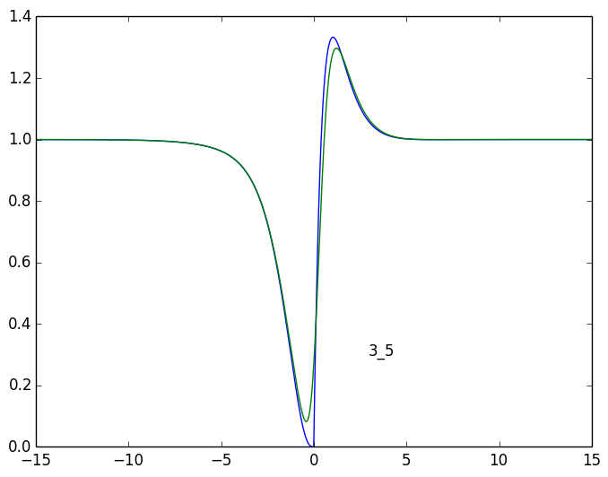
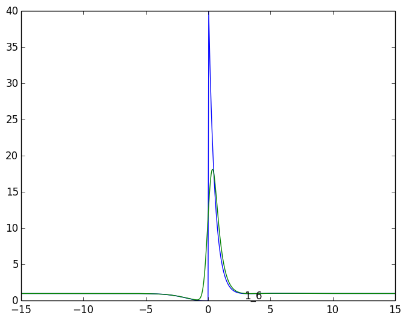
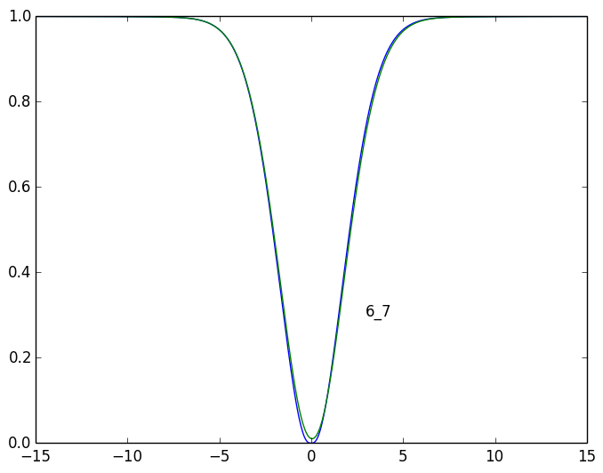
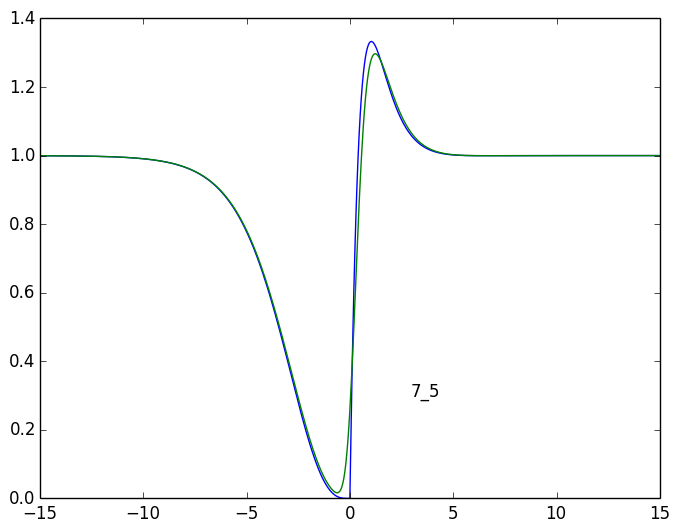

# 1_3

## tau > 0
	  1 | a:    1.000 +   -0.000i 	 l:    0.000 +    0.000i
	  2 | a:    1.739 +   -0.690i 	 l:   -1.979 +    1.014i
	  3 | a:    1.739 +    0.690i 	 l:   -1.979 +   -1.014i
	  4 | a:   -2.859 +   -0.000i 	 l:   -2.332 +    0.000i
	  5 | a:    0.238 +   -0.000i 	 l:   -0.638 +    0.000i
	  6 | a:   -0.928 +   -0.872i 	 l:   -1.151 +    0.553i
	  7 | a:   -0.928 +    0.872i 	 l:   -1.151 +   -0.553i
## tau < 0
	  1 | a:    1.000 +    0.000i 	 l:    0.000 +    0.000i
	  2 | a:   -0.763 +   -0.774i 	 l:   -1.979 +    1.014i
	  3 | a:   -0.763 +    0.774i 	 l:   -1.979 +   -1.014i
	  4 | a:    0.623 +   -0.000i 	 l:   -2.332 +    0.000i
	  5 | a:   -0.263 +   -0.000i 	 l:   -0.638 +    0.000i
	  6 | a:    0.082 +    2.812i 	 l:   -1.151 +    0.553i
	  7 | a:    0.082 +   -2.812i 	 l:   -1.151 +   -0.553i

# 3_5

## tau > 0
	  1 | a:    1.000 +    0.000i 	 l:    0.000 +    0.000i
	  2 | a:   -0.540 +   -0.470i 	 l:   -1.979 +    1.014i
	  3 | a:   -0.540 +    0.470i 	 l:   -1.979 +   -1.014i
	  6 | a:    0.037 +   -0.836i 	 l:   -1.151 +    0.553i
	  7 | a:    0.037 +    0.836i 	 l:   -1.151 +   -0.553i
## tau < 0
	  1 | a:    1.000 +   -0.000i 	 l:    0.000 +    0.000i
	  2 | a:    0.349 +   -0.250i 	 l:   -1.979 +    1.014i
	  3 | a:    0.349 +    0.250i 	 l:   -1.979 +   -1.014i
	  4 | a:   -0.141 +    0.000i 	 l:   -2.332 +    0.000i
	  5 | a:   -0.924 +   -0.000i 	 l:   -0.638 +    0.000i
	  6 | a:   -0.317 +    0.699i 	 l:   -1.151 +    0.553i
	  7 | a:   -0.317 +   -0.699i 	 l:   -1.151 +   -0.553i

# 2_3

## tau > 0
	  1 | a:    1.000 +    0.000i 	 l:    0.000 +    0.000i
	  2 | a:    2.383 +    0.461i 	 l:   -1.979 +    1.014i
	  3 | a:    2.383 +   -0.461i 	 l:   -1.979 +   -1.014i
	  4 | a:    0.844 +    0.000i 	 l:   -2.332 +    0.000i
	  5 | a:    0.806 +    0.000i 	 l:   -0.638 +    0.000i
	  6 | a:    0.436 +   -0.255i 	 l:   -1.151 +    0.553i
	  7 | a:    0.436 +    0.255i 	 l:   -1.151 +   -0.553i
	  8 | a:   -8.288 +    0.000i 	 l: -1000.000 +    0.000i
## tau < 0
	  1 | a:    1.000 +    0.000i 	 l:    0.000 +    0.000i
	  2 | a:   -0.763 +   -0.774i 	 l:   -1.979 +    1.014i
	  3 | a:   -0.763 +    0.774i 	 l:   -1.979 +   -1.014i
	  4 | a:    0.623 +   -0.000i 	 l:   -2.332 +    0.000i
	  5 | a:   -0.263 +   -0.000i 	 l:   -0.638 +    0.000i
	  6 | a:    0.082 +    2.812i 	 l:   -1.151 +    0.553i
	  7 | a:    0.082 +   -2.812i 	 l:   -1.151 +   -0.553i

# 1_6

## tau > 0
	  1 | a:    1.000 +   -0.000i 	 l:    0.000 +    0.000i
	  2 | a:    2.434 +   -0.498i 	 l:   -1.979 +    1.014i
	  3 | a:    2.434 +    0.498i 	 l:   -1.979 +   -1.014i
	  4 | a:   27.753 +    0.000i 	 l:   -2.332 +    0.000i
	  5 | a:    1.397 +   -0.000i 	 l:   -0.638 +    0.000i
	  6 | a:    4.559 +    3.334i 	 l:   -1.151 +    0.553i
	  7 | a:    4.559 +   -3.334i 	 l:   -1.151 +   -0.553i
## tau < 0
	  1 | a:    1.000 +    0.000i 	 l:    0.000 +    0.000i
	  2 | a:   -0.763 +   -0.774i 	 l:   -1.979 +    1.014i
	  3 | a:   -0.763 +    0.774i 	 l:   -1.979 +   -1.014i
	  4 | a:    0.623 +   -0.000i 	 l:   -2.332 +    0.000i
	  5 | a:   -0.263 +   -0.000i 	 l:   -0.638 +    0.000i
	  6 | a:    0.082 +    2.812i 	 l:   -1.151 +    0.553i
	  7 | a:    0.082 +   -2.812i 	 l:   -1.151 +   -0.553i

# 2_6

## tau > 0
	  1 | a:    1.000 +    0.000i 	 l:    0.000 +    0.000i
	  2 | a:    3.008 +    1.158i 	 l:   -1.979 +    1.014i
	  3 | a:    3.008 +   -1.158i 	 l:   -1.979 +   -1.014i
	  4 | a:   -8.192 +   -0.000i 	 l:   -2.332 +    0.000i
	  5 | a:    4.731 +    0.000i 	 l:   -0.638 +    0.000i
	  6 | a:   -1.780 +    1.357i 	 l:   -1.151 +    0.553i
	  7 | a:   -1.780 +   -1.357i 	 l:   -1.151 +   -0.553i
## tau < 0
	  1 | a:    1.000 +    0.000i 	 l:    0.000 +    0.000i
	  2 | a:   -0.763 +   -0.774i 	 l:   -1.979 +    1.014i
	  3 | a:   -0.763 +    0.774i 	 l:   -1.979 +   -1.014i
	  4 | a:    0.623 +   -0.000i 	 l:   -2.332 +    0.000i
	  5 | a:   -0.263 +   -0.000i 	 l:   -0.638 +    0.000i
	  6 | a:    0.082 +    2.812i 	 l:   -1.151 +    0.553i
	  7 | a:    0.082 +   -2.812i 	 l:   -1.151 +   -0.553i

# 4_5

## tau > 0
	  1 | a:    1.000 +    0.000i 	 l:    0.000 +    0.000i
	  2 | a:    1.005 +   -0.088i 	 l:   -1.979 +    1.014i
	  3 | a:    1.005 +    0.088i 	 l:   -1.979 +   -1.014i
	  6 | a:    0.457 +    0.147i 	 l:   -1.151 +    0.553i
	  7 | a:    0.457 +   -0.147i 	 l:   -1.151 +   -0.553i
## tau < 0
	  1 | a:    1.000 +   -0.000i 	 l:    0.000 +    0.000i
	  2 | a:   -0.540 +   -0.442i 	 l:   -1.979 +    1.014i
	  3 | a:   -0.540 +    0.442i 	 l:   -1.979 +   -1.014i
	  4 | a:    0.383 +   -0.000i 	 l:   -2.332 +    0.000i
	  5 | a:   -1.475 +   -0.000i 	 l:   -0.638 +    0.000i
	  6 | a:    0.586 +    1.564i 	 l:   -1.151 +    0.553i
	  7 | a:    0.586 +   -1.564i 	 l:   -1.151 +   -0.553i

# 1_7

## tau > 0
	  1 | a:    1.000 +   -0.000i 	 l:    0.000 +    0.000i
	  2 | a:    2.434 +   -0.498i 	 l:   -1.979 +    1.014i
	  3 | a:    2.434 +    0.498i 	 l:   -1.979 +   -1.014i
	  4 | a:   27.753 +    0.000i 	 l:   -2.332 +    0.000i
	  5 | a:    1.397 +   -0.000i 	 l:   -0.638 +    0.000i
	  6 | a:    4.559 +    3.334i 	 l:   -1.151 +    0.553i
	  7 | a:    4.559 +   -3.334i 	 l:   -1.151 +   -0.553i
## tau < 0
	  1 | a:    1.000 +   -0.000i 	 l:    0.000 +    0.000i
	  2 | a:   -0.765 +   -0.774i 	 l:   -1.979 +    1.014i
	  3 | a:   -0.765 +    0.774i 	 l:   -1.979 +   -1.014i
	  4 | a:    0.624 +   -0.000i 	 l:   -2.332 +    0.000i
	  5 | a:   -0.263 +   -0.000i 	 l:   -0.638 +    0.000i
	  6 | a:    0.084 +    2.815i 	 l:   -1.151 +    0.553i
	  7 | a:    0.084 +   -2.815i 	 l:   -1.151 +   -0.553i

# 2_7

## tau > 0
	  1 | a:    1.000 +    0.000i 	 l:    0.000 +    0.000i
	  2 | a:    3.008 +    1.158i 	 l:   -1.979 +    1.014i
	  3 | a:    3.008 +   -1.158i 	 l:   -1.979 +   -1.014i
	  4 | a:   -8.192 +   -0.000i 	 l:   -2.332 +    0.000i
	  5 | a:    4.731 +    0.000i 	 l:   -0.638 +    0.000i
	  6 | a:   -1.780 +    1.357i 	 l:   -1.151 +    0.553i
	  7 | a:   -1.780 +   -1.357i 	 l:   -1.151 +   -0.553i
## tau < 0
	  1 | a:    1.000 +   -0.000i 	 l:    0.000 +    0.000i
	  2 | a:   -0.765 +   -0.774i 	 l:   -1.979 +    1.014i
	  3 | a:   -0.765 +    0.774i 	 l:   -1.979 +   -1.014i
	  4 | a:    0.624 +   -0.000i 	 l:   -2.332 +    0.000i
	  5 | a:   -0.263 +   -0.000i 	 l:   -0.638 +    0.000i
	  6 | a:    0.084 +    2.815i 	 l:   -1.151 +    0.553i
	  7 | a:    0.084 +   -2.815i 	 l:   -1.151 +   -0.553i

# 3_7

## tau > 0
	  1 | a:    1.000 +    0.000i 	 l:    0.000 +    0.000i
	  2 | a:   -0.622 +    1.247i 	 l:   -1.979 +    1.014i
	  3 | a:   -0.622 +   -1.247i 	 l:   -1.979 +   -1.014i
	  4 | a:   -3.345 +    0.000i 	 l:   -2.332 +    0.000i
	  5 | a:   -0.303 +   -0.000i 	 l:   -0.638 +    0.000i
	  6 | a:    1.946 +    3.116i 	 l:   -1.151 +    0.553i
	  7 | a:    1.946 +   -3.116i 	 l:   -1.151 +   -0.553i
## tau < 0
	  1 | a:    1.000 +   -0.000i 	 l:    0.000 +    0.000i
	  2 | a:   -0.297 +    1.009i 	 l:   -1.979 +    1.014i
	  3 | a:   -0.297 +   -1.009i 	 l:   -1.979 +   -1.014i
	  4 | a:    0.345 +   -0.000i 	 l:   -2.332 +    0.000i
	  6 | a:   -0.350 +   -0.752i 	 l:   -1.151 +    0.553i
	  7 | a:   -0.350 +    0.752i 	 l:   -1.151 +   -0.553i

# 5_7

## tau > 0
	  1 | a:    1.000 +   -0.000i 	 l:    0.000 +    0.000i
	  2 | a:    0.514 +   -0.246i 	 l:   -1.979 +    1.014i
	  3 | a:    0.514 +    0.246i 	 l:   -1.979 +   -1.014i
	  4 | a:    1.364 +   -0.000i 	 l:   -2.332 +    0.000i
	  5 | a:   -5.419 +   -0.000i 	 l:   -0.638 +    0.000i
	  6 | a:    1.013 +   -3.247i 	 l:   -1.151 +    0.553i
	  7 | a:    1.013 +    3.247i 	 l:   -1.151 +   -0.553i
## tau < 0
	  1 | a:    1.000 +   -0.000i 	 l:    0.000 +    0.000i
	  2 | a:   -0.542 +   -0.470i 	 l:   -1.979 +    1.014i
	  3 | a:   -0.542 +    0.470i 	 l:   -1.979 +   -1.014i
	  6 | a:    0.037 +   -0.837i 	 l:   -1.151 +    0.553i
	  7 | a:    0.037 +    0.837i 	 l:   -1.151 +   -0.553i

# 6_7

## tau > 0
	  1 | a:    1.000 +    0.000i 	 l:    0.000 +    0.000i
	  2 | a:   -0.622 +    1.247i 	 l:   -1.979 +    1.014i
	  3 | a:   -0.622 +   -1.247i 	 l:   -1.979 +   -1.014i
	  4 | a:   -3.345 +    0.000i 	 l:   -2.332 +    0.000i
	  5 | a:   -0.303 +   -0.000i 	 l:   -0.638 +    0.000i
	  6 | a:    1.946 +    3.116i 	 l:   -1.151 +    0.553i
	  7 | a:    1.946 +   -3.116i 	 l:   -1.151 +   -0.553i
## tau < 0
	  1 | a:    1.000 +   -0.000i 	 l:    0.000 +    0.000i
	  2 | a:   -0.622 +    1.250i 	 l:   -1.979 +    1.014i
	  3 | a:   -0.622 +   -1.250i 	 l:   -1.979 +   -1.014i
	  4 | a:   -3.353 +    0.000i 	 l:   -2.332 +    0.000i
	  5 | a:   -0.303 +   -0.000i 	 l:   -0.638 +    0.000i
	  6 | a:    1.950 +    3.118i 	 l:   -1.151 +    0.553i
	  7 | a:    1.950 +   -3.118i 	 l:   -1.151 +   -0.553i

# 7_5

## tau > 0
	  1 | a:    1.000 +   -0.000i 	 l:    0.000 +    0.000i
	  2 | a:   -0.542 +   -0.470i 	 l:   -1.979 +    1.014i
	  3 | a:   -0.542 +    0.470i 	 l:   -1.979 +   -1.014i
	  6 | a:    0.037 +   -0.837i 	 l:   -1.151 +    0.553i
	  7 | a:    0.037 +    0.837i 	 l:   -1.151 +   -0.553i
## tau < 0
	  1 | a:    1.000 +   -0.000i 	 l:    0.000 +    0.000i
	  2 | a:    0.514 +   -0.246i 	 l:   -1.979 +    1.014i
	  3 | a:    0.514 +    0.246i 	 l:   -1.979 +   -1.014i
	  4 | a:    1.364 +   -0.000i 	 l:   -2.332 +    0.000i
	  5 | a:   -5.419 +   -0.000i 	 l:   -0.638 +    0.000i
	  6 | a:    1.013 +   -3.247i 	 l:   -1.151 +    0.553i
	  7 | a:    1.013 +    3.247i 	 l:   -1.151 +   -0.553i
