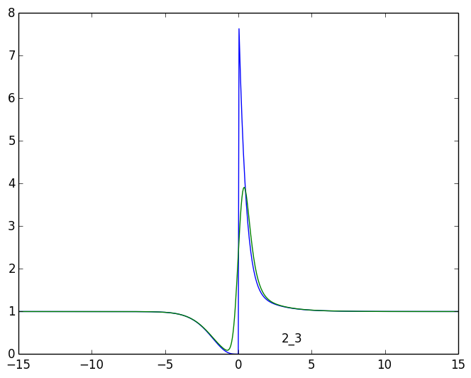

# 1_3

## tau > 0
	  1 | a:    7.341 +    4.342i 	 l:   -1.855 +    0.790i
	  2 | a:    7.341 +   -4.342i 	 l:   -1.855 +   -0.790i
	  4 | a:    1.000 +    0.000i 	 l:    0.000 +    0.000i
	  5 | a:    0.919 +    0.000i 	 l:   -0.388 +    0.000i
	  6 | a:    0.925 +    0.000i 	 l:   -0.674 +    0.000i
	  8 | a:   -2.435 +    3.963i 	 l:   -1.069 +   -0.438i
## tau < 0
	  4 | a:    1.000 +    0.000i 	 l:    0.000 +    0.000i
	  6 | a:    0.193 +    0.000i 	 l:   -0.674 +    0.000i
	  7 | a:    1.105 +    0.351i 	 l:   -1.069 +    0.438i
	  8 | a:    1.105 +   -0.351i 	 l:   -1.069 +   -0.438i

# 3_5

## tau > 0
	  4 | a:    1.000 +    0.000i 	 l:    0.000 +    0.000i
## tau < 0
	  1 | a:    0.488 +   -0.344i 	 l:   -1.855 +    0.790i
	  2 | a:    0.488 +    0.344i 	 l:   -1.855 +   -0.790i
	  4 | a:    1.000 +   -0.000i 	 l:    0.000 +    0.000i
	  7 | a:   -0.384 +    0.715i 	 l:   -1.069 +    0.438i

# 2_3

## tau > 0
	  1 | a:    7.937 +    3.181i 	 l:   -1.855 +    0.790i
	  2 | a:    7.937 +   -3.181i 	 l:   -1.855 +   -0.790i
	  3 | a:    2.865 +    0.000i 	 l:   -2.109 +    0.000i
	  4 | a:    1.000 +    0.000i 	 l:    0.000 +    0.000i
	  5 | a:    1.111 +    0.000i 	 l:   -0.388 +    0.000i
	  6 | a:    2.128 +    0.000i 	 l:   -0.674 +    0.000i
	  7 | a:    0.956 +   -0.141i 	 l:   -1.069 +    0.438i
	  8 | a:    0.956 +    0.141i 	 l:   -1.069 +   -0.438i
## tau < 0
	  4 | a:    1.000 +    0.000i 	 l:    0.000 +    0.000i
	  6 | a:    0.193 +    0.000i 	 l:   -0.674 +    0.000i
	  7 | a:    1.105 +    0.351i 	 l:   -1.069 +    0.438i
	  8 | a:    1.105 +   -0.351i 	 l:   -1.069 +   -0.438i

# 1_6

## tau > 0
	  1 | a:   16.959 +   15.653i 	 l:   -1.855 +    0.790i
	  2 | a:   16.959 +  -15.653i 	 l:   -1.855 +   -0.790i
	  3 | a:  168.958 +   -0.000i 	 l:   -2.109 +    0.000i
	  4 | a:    1.000 +    0.000i 	 l:    0.000 +    0.000i
	  5 | a:    2.742 +    0.000i 	 l:   -0.388 +    0.000i
	  6 | a:   10.031 +    0.000i 	 l:   -0.674 +    0.000i
	  7 | a:   33.264 +   36.696i 	 l:   -1.069 +    0.438i
	  8 | a:   33.264 +  -36.696i 	 l:   -1.069 +   -0.438i
	  9 | a:   20.749 +   -0.000i 	 l:   -1.165 +    0.000i
## tau < 0
	  4 | a:    1.000 +    0.000i 	 l:    0.000 +    0.000i
	  6 | a:    0.193 +    0.000i 	 l:   -0.674 +    0.000i
	  7 | a:    1.105 +    0.351i 	 l:   -1.069 +    0.438i
	  8 | a:    1.105 +   -0.351i 	 l:   -1.069 +   -0.438i

# 2_6

## tau > 0
	  1 | a:   19.196 +   12.919i 	 l:   -1.855 +    0.790i
	  2 | a:   19.196 +  -12.919i 	 l:   -1.855 +   -0.790i
	  4 | a:    1.000 +    0.000i 	 l:    0.000 +    0.000i
	  5 | a:    3.314 +    0.000i 	 l:   -0.388 +    0.000i
	  6 | a:   23.070 +    0.000i 	 l:   -0.674 +    0.000i
	  7 | a:   -9.732 +    3.349i 	 l:   -1.069 +    0.438i
## tau < 0
	  4 | a:    1.000 +    0.000i 	 l:    0.000 +    0.000i
	  6 | a:    0.193 +    0.000i 	 l:   -0.674 +    0.000i
	  7 | a:    1.105 +    0.351i 	 l:   -1.069 +    0.438i
	  8 | a:    1.105 +   -0.351i 	 l:   -1.069 +   -0.438i

# 4_5

## tau > 0
	  1 | a:    0.570 +   -0.390i 	 l:   -1.855 +    0.790i
	  2 | a:    0.570 +    0.390i 	 l:   -1.855 +   -0.790i
	  4 | a:    1.000 +    0.000i 	 l:    0.000 +    0.000i
	  5 | a:    0.168 +    0.000i 	 l:   -0.388 +    0.000i
	  7 | a:    0.270 +   -0.190i 	 l:   -1.069 +    0.438i
	  8 | a:    0.270 +    0.190i 	 l:   -1.069 +   -0.438i
	  9 | a:    1.257 +    0.000i 	 l:   -1.165 +    0.000i
## tau < 0
	  2 | a:   -0.804 +    0.339i 	 l:   -1.855 +   -0.790i
	  3 | a:    0.390 +    0.000i 	 l:   -2.109 +    0.000i
	  4 | a:    1.000 +   -0.000i 	 l:    0.000 +    0.000i
	  7 | a:    0.989 +    1.854i 	 l:   -1.069 +    0.438i
	  8 | a:    0.989 +   -1.854i 	 l:   -1.069 +   -0.438i
	  9 | a:    0.193 +   -0.000i 	 l:   -1.165 +    0.000i

# 1_7

## tau > 0
	  1 | a:   16.959 +   15.653i 	 l:   -1.855 +    0.790i
	  2 | a:   16.959 +  -15.653i 	 l:   -1.855 +   -0.790i
	  3 | a:  168.958 +   -0.000i 	 l:   -2.109 +    0.000i
	  4 | a:    1.000 +    0.000i 	 l:    0.000 +    0.000i
	  5 | a:    2.742 +    0.000i 	 l:   -0.388 +    0.000i
	  6 | a:   10.031 +    0.000i 	 l:   -0.674 +    0.000i
	  7 | a:   33.264 +   36.696i 	 l:   -1.069 +    0.438i
	  8 | a:   33.264 +  -36.696i 	 l:   -1.069 +   -0.438i
	  9 | a:   20.749 +   -0.000i 	 l:   -1.165 +    0.000i
## tau < 0
	  2 | a:   -3.262 +    2.345i 	 l:   -1.855 +   -0.790i
	  3 | a:    1.923 +    0.000i 	 l:   -2.109 +    0.000i
	  4 | a:    1.000 +   -0.000i 	 l:    0.000 +    0.000i
	  5 | a:    1.746 +    0.000i 	 l:   -0.388 +    0.000i
	  6 | a:    4.208 +    0.000i 	 l:   -0.674 +    0.000i
	  7 | a:   -2.756 +   11.942i 	 l:   -1.069 +    0.438i
	  9 | a:    3.159 +   -0.000i 	 l:   -1.165 +    0.000i

# 2_7

## tau > 0
	  1 | a:   19.196 +   12.919i 	 l:   -1.855 +    0.790i
	  2 | a:   19.196 +  -12.919i 	 l:   -1.855 +   -0.790i
	  4 | a:    1.000 +    0.000i 	 l:    0.000 +    0.000i
	  5 | a:    3.314 +    0.000i 	 l:   -0.388 +    0.000i
	  6 | a:   23.070 +    0.000i 	 l:   -0.674 +    0.000i
	  7 | a:   -9.732 +    3.349i 	 l:   -1.069 +    0.438i
## tau < 0
	  2 | a:   -3.262 +    2.345i 	 l:   -1.855 +   -0.790i
	  3 | a:    1.923 +    0.000i 	 l:   -2.109 +    0.000i
	  4 | a:    1.000 +   -0.000i 	 l:    0.000 +    0.000i
	  5 | a:    1.746 +    0.000i 	 l:   -0.388 +    0.000i
	  6 | a:    4.208 +    0.000i 	 l:   -0.674 +    0.000i
	  7 | a:   -2.756 +   11.942i 	 l:   -1.069 +    0.438i
	  9 | a:    3.159 +   -0.000i 	 l:   -1.165 +    0.000i

# 3_7

## tau > 0
	  1 | a:   -0.013 +    0.696i 	 l:   -1.855 +    0.790i
	  4 | a:    1.000 +    0.000i 	 l:    0.000 +    0.000i
	  6 | a:    0.297 +    0.000i 	 l:   -0.674 +    0.000i
	  7 | a:    2.288 +   -0.403i 	 l:   -1.069 +    0.438i
	  8 | a:    2.288 +    0.403i 	 l:   -1.069 +   -0.438i
## tau < 0
	  1 | a:   -1.609 +    3.162i 	 l:   -1.855 +    0.790i
	  3 | a:    1.319 +    0.000i 	 l:   -2.109 +    0.000i
	  4 | a:    1.000 +   -0.000i 	 l:    0.000 +    0.000i
	  5 | a:    0.732 +    0.000i 	 l:   -0.388 +    0.000i
	  6 | a:    0.597 +    0.000i 	 l:   -0.674 +    0.000i
	  8 | a:   -0.160 +    2.301i 	 l:   -1.069 +   -0.438i

# 5_7

## tau > 0
	  1 | a:    1.487 +   -0.633i 	 l:   -1.855 +    0.790i
	  2 | a:    1.487 +    0.633i 	 l:   -1.855 +   -0.790i
	  3 | a:    2.926 +    0.000i 	 l:   -2.109 +    0.000i
	  4 | a:    1.000 +   -0.000i 	 l:    0.000 +    0.000i
	  7 | a:    2.615 +   -8.238i 	 l:   -1.069 +    0.438i
	  8 | a:    2.615 +    8.238i 	 l:   -1.069 +   -0.438i
## tau < 0
	  2 | a:   -1.156 +    0.663i 	 l:   -1.855 +   -0.790i
	  4 | a:    1.000 +   -0.000i 	 l:    0.000 +    0.000i
	  5 | a:    0.284 +    0.000i 	 l:   -0.388 +    0.000i
	  6 | a:    0.476 +    0.000i 	 l:   -0.674 +    0.000i
	  8 | a:   -0.191 +    0.920i 	 l:   -1.069 +   -0.438i
	  9 | a:    1.050 +   -0.000i 	 l:   -1.165 +    0.000i

# 6_7

## tau > 0
	  1 | a:   -0.013 +    0.696i 	 l:   -1.855 +    0.790i
	  4 | a:    1.000 +    0.000i 	 l:    0.000 +    0.000i
	  6 | a:    0.297 +    0.000i 	 l:   -0.674 +    0.000i
	  7 | a:    2.288 +   -0.403i 	 l:   -1.069 +    0.438i
	  8 | a:    2.288 +    0.403i 	 l:   -1.069 +   -0.438i
## tau < 0
	  1 | a:   -6.052 +    7.454i 	 l:   -1.855 +    0.790i
	  4 | a:    1.000 +   -0.000i 	 l:    0.000 +    0.000i
	  5 | a:    2.184 +    0.000i 	 l:   -0.388 +    0.000i
	  6 | a:    6.476 +    0.000i 	 l:   -0.674 +    0.000i
	  7 | a:    6.190 +   23.764i 	 l:   -1.069 +    0.438i
	  8 | a:    6.190 +  -23.764i 	 l:   -1.069 +   -0.438i
	  9 | a:    8.075 +   -0.000i 	 l:   -1.165 +    0.000i

# 7_5

## tau > 0
	  2 | a:   -1.156 +    0.663i 	 l:   -1.855 +   -0.790i
	  4 | a:    1.000 +   -0.000i 	 l:    0.000 +    0.000i
	  5 | a:    0.284 +    0.000i 	 l:   -0.388 +    0.000i
	  6 | a:    0.476 +    0.000i 	 l:   -0.674 +    0.000i
	  8 | a:   -0.191 +    0.920i 	 l:   -1.069 +   -0.438i
	  9 | a:    1.050 +   -0.000i 	 l:   -1.165 +    0.000i
## tau < 0
	  1 | a:    1.487 +   -0.633i 	 l:   -1.855 +    0.790i
	  2 | a:    1.487 +    0.633i 	 l:   -1.855 +   -0.790i
	  3 | a:    2.926 +    0.000i 	 l:   -2.109 +    0.000i
	  4 | a:    1.000 +   -0.000i 	 l:    0.000 +    0.000i
	  7 | a:    2.615 +   -8.238i 	 l:   -1.069 +    0.438i
	  8 | a:    2.615 +    8.238i 	 l:   -1.069 +   -0.438i
