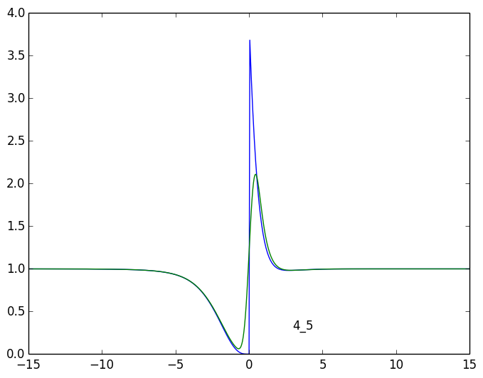
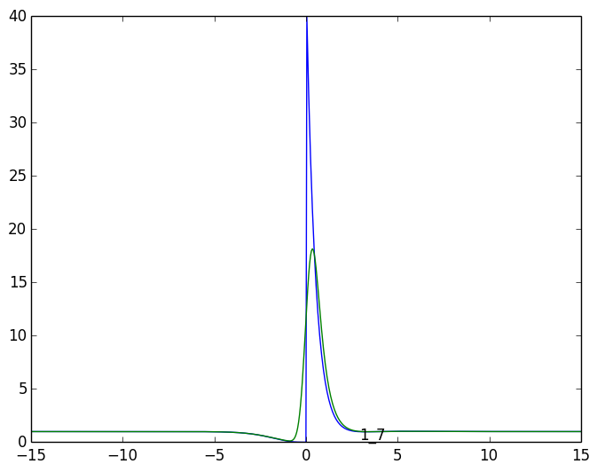
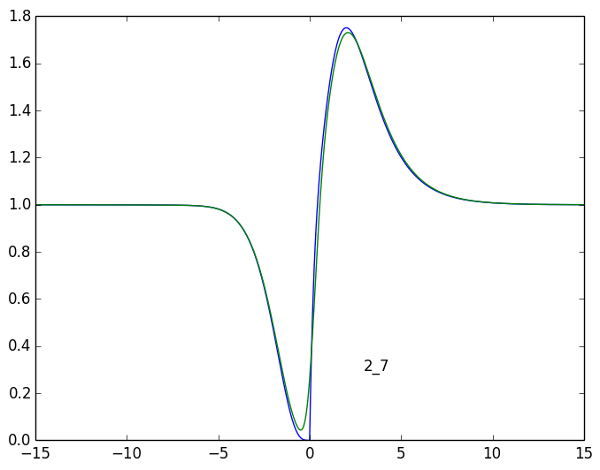

# 1_3

## tau > 0
	  1 | a:    2.785 +    0.757i 	 l:   -2.057 +    1.026i
	  2 | a:    2.785 +   -0.757i 	 l:   -2.057 +   -1.026i
	  3 | a:   -3.530 +    0.000i 	 l:   -2.234 +    0.000i
	  4 | a:    1.000 +   -0.000i 	 l:    0.000 +    0.000i
	  5 | a:   -1.612 +   -1.395i 	 l:   -1.111 +    0.572i
	  6 | a:   -1.612 +    1.395i 	 l:   -1.111 +   -0.572i
	  7 | a:    0.199 +   -0.000i 	 l:   -0.527 +    0.000i
## tau < 0
	  1 | a:   -0.297 +   -0.102i 	 l:   -2.057 +    1.026i
	  2 | a:   -0.297 +    0.102i 	 l:   -2.057 +   -1.026i
	  3 | a:    0.178 +   -0.000i 	 l:   -2.234 +    0.000i
	  4 | a:    1.000 +   -0.000i 	 l:    0.000 +    0.000i
	  5 | a:    0.697 +    0.680i 	 l:   -1.111 +    0.572i
	  6 | a:    0.697 +   -0.680i 	 l:   -1.111 +   -0.572i
	  7 | a:   -2.670 +   -0.000i 	 l:   -0.527 +    0.000i
	  8 | a:    1.418 +   -0.000i 	 l:   -0.717 +    0.000i
	  9 | a:   -0.724 +   -0.000i 	 l:   -1.244 +    0.000i

# 3_5

## tau > 0
	  1 | a:   -0.197 +   -0.053i 	 l:   -2.057 +    1.026i
	  2 | a:   -0.197 +    0.053i 	 l:   -2.057 +   -1.026i
	  4 | a:    1.000 +   -0.000i 	 l:    0.000 +    0.000i
	  5 | a:   -0.114 +   -0.123i 	 l:   -1.111 +    0.572i
	  6 | a:   -0.114 +    0.123i 	 l:   -1.111 +   -0.572i
	  7 | a:   -0.104 +   -0.000i 	 l:   -0.527 +    0.000i
	  8 | a:    0.112 +   -0.000i 	 l:   -0.717 +    0.000i
	  9 | a:   -0.362 +   -0.000i 	 l:   -1.244 +    0.000i
## tau < 0
	  1 | a:    0.398 +   -0.248i 	 l:   -2.057 +    1.026i
	  2 | a:    0.398 +    0.248i 	 l:   -2.057 +   -1.026i
	  3 | a:   -0.196 +   -0.000i 	 l:   -2.234 +    0.000i
	  4 | a:    1.000 +   -0.000i 	 l:    0.000 +    0.000i
	  5 | a:   -0.414 +    0.633i 	 l:   -1.111 +    0.572i
	  6 | a:   -0.414 +   -0.633i 	 l:   -1.111 +   -0.572i
	  7 | a:   -0.270 +    0.000i 	 l:   -0.527 +    0.000i
	  8 | a:   -0.516 +    0.000i 	 l:   -0.717 +    0.000i

# 2_3

## tau > 0
	  1 | a:    3.167 +    0.900i 	 l:   -2.057 +    1.026i
	  2 | a:    3.167 +   -0.900i 	 l:   -2.057 +   -1.026i
	  3 | a:    0.986 +    0.000i 	 l:   -2.234 +    0.000i
	  4 | a:    1.000 +    0.000i 	 l:    0.000 +    0.000i
	  5 | a:    0.712 +   -0.244i 	 l:   -1.111 +    0.572i
	  6 | a:    0.712 +    0.244i 	 l:   -1.111 +   -0.572i
	  7 | a:    0.374 +    0.000i 	 l:   -0.527 +    0.000i
	  8 | a:    0.560 +    0.000i 	 l:   -0.717 +    0.000i
	 10 | a:  -10.683 +    0.000i 	 l: -1000.000 +    0.000i
## tau < 0
	  1 | a:   -0.297 +   -0.102i 	 l:   -2.057 +    1.026i
	  2 | a:   -0.297 +    0.102i 	 l:   -2.057 +   -1.026i
	  3 | a:    0.178 +   -0.000i 	 l:   -2.234 +    0.000i
	  4 | a:    1.000 +   -0.000i 	 l:    0.000 +    0.000i
	  5 | a:    0.697 +    0.680i 	 l:   -1.111 +    0.572i
	  6 | a:    0.697 +   -0.680i 	 l:   -1.111 +   -0.572i
	  7 | a:   -2.670 +   -0.000i 	 l:   -0.527 +    0.000i
	  8 | a:    1.418 +   -0.000i 	 l:   -0.717 +    0.000i
	  9 | a:   -0.724 +   -0.000i 	 l:   -1.244 +    0.000i

# 1_6

## tau > 0
	  1 | a:    4.239 +    2.031i 	 l:   -2.057 +    1.026i
	  2 | a:    4.239 +   -2.031i 	 l:   -2.057 +   -1.026i
	  3 | a:   38.202 +   -0.000i 	 l:   -2.234 +    0.000i
	  4 | a:    1.000 +   -0.000i 	 l:    0.000 +    0.000i
	  5 | a:   11.962 +    6.739i 	 l:   -1.111 +    0.572i
	  6 | a:   11.962 +   -6.739i 	 l:   -1.111 +   -0.572i
	  7 | a:    0.932 +   -0.000i 	 l:   -0.527 +    0.000i
	  8 | a:    0.952 +   -0.000i 	 l:   -0.717 +    0.000i
	  9 | a:    3.613 +   -0.000i 	 l:   -1.244 +    0.000i
## tau < 0
	  1 | a:   -0.297 +   -0.102i 	 l:   -2.057 +    1.026i
	  2 | a:   -0.297 +    0.102i 	 l:   -2.057 +   -1.026i
	  3 | a:    0.178 +   -0.000i 	 l:   -2.234 +    0.000i
	  4 | a:    1.000 +   -0.000i 	 l:    0.000 +    0.000i
	  5 | a:    0.697 +    0.680i 	 l:   -1.111 +    0.572i
	  6 | a:    0.697 +   -0.680i 	 l:   -1.111 +   -0.572i
	  7 | a:   -2.670 +   -0.000i 	 l:   -0.527 +    0.000i
	  8 | a:    1.418 +   -0.000i 	 l:   -0.717 +    0.000i
	  9 | a:   -0.724 +   -0.000i 	 l:   -1.244 +    0.000i

# 2_6

## tau > 0
	  1 | a:    4.808 +    2.372i 	 l:   -2.057 +    1.026i
	  2 | a:    4.808 +   -2.372i 	 l:   -2.057 +   -1.026i
	  3 | a:  -10.674 +   -0.000i 	 l:   -2.234 +    0.000i
	  4 | a:    1.000 +    0.000i 	 l:    0.000 +    0.000i
	  5 | a:   -4.182 +    2.452i 	 l:   -1.111 +    0.572i
	  6 | a:   -4.182 +   -2.452i 	 l:   -1.111 +   -0.572i
	  7 | a:    1.753 +    0.000i 	 l:   -0.527 +    0.000i
	  8 | a:    6.836 +    0.000i 	 l:   -0.717 +    0.000i
	  9 | a:   -0.166 +    0.000i 	 l:   -1.244 +    0.000i
## tau < 0
	  1 | a:   -0.297 +   -0.102i 	 l:   -2.057 +    1.026i
	  2 | a:   -0.297 +    0.102i 	 l:   -2.057 +   -1.026i
	  3 | a:    0.178 +   -0.000i 	 l:   -2.234 +    0.000i
	  4 | a:    1.000 +   -0.000i 	 l:    0.000 +    0.000i
	  5 | a:    0.697 +    0.680i 	 l:   -1.111 +    0.572i
	  6 | a:    0.697 +   -0.680i 	 l:   -1.111 +   -0.572i
	  7 | a:   -2.670 +   -0.000i 	 l:   -0.527 +    0.000i
	  8 | a:    1.418 +   -0.000i 	 l:   -0.717 +    0.000i
	  9 | a:   -0.724 +   -0.000i 	 l:   -1.244 +    0.000i

# 4_5

## tau > 0
	  1 | a:    0.723 +   -0.240i 	 l:   -2.057 +    1.026i
	  2 | a:    0.723 +    0.240i 	 l:   -2.057 +   -1.026i
	  4 | a:    1.000 +   -0.000i 	 l:    0.000 +    0.000i
	  5 | a:    0.280 +    0.021i 	 l:   -1.111 +    0.572i
	  6 | a:    0.280 +   -0.021i 	 l:   -1.111 +   -0.572i
	  9 | a:    0.538 +    0.000i 	 l:   -1.244 +    0.000i
## tau < 0
	  1 | a:   -0.556 +   -0.383i 	 l:   -2.057 +    1.026i
	  2 | a:   -0.556 +    0.383i 	 l:   -2.057 +   -1.026i
	  3 | a:    0.507 +    0.000i 	 l:   -2.234 +    0.000i
	  4 | a:    1.000 +   -0.000i 	 l:    0.000 +    0.000i
	  5 | a:    0.434 +    1.545i 	 l:   -1.111 +    0.572i
	  6 | a:    0.434 +   -1.545i 	 l:   -1.111 +   -0.572i
	  7 | a:   -0.401 +    0.000i 	 l:   -0.527 +    0.000i
	  8 | a:   -0.929 +    0.000i 	 l:   -0.717 +    0.000i

# 1_7

## tau > 0
	  1 | a:    4.239 +    2.031i 	 l:   -2.057 +    1.026i
	  2 | a:    4.239 +   -2.031i 	 l:   -2.057 +   -1.026i
	  3 | a:   38.202 +   -0.000i 	 l:   -2.234 +    0.000i
	  4 | a:    1.000 +   -0.000i 	 l:    0.000 +    0.000i
	  5 | a:   11.962 +    6.739i 	 l:   -1.111 +    0.572i
	  6 | a:   11.962 +   -6.739i 	 l:   -1.111 +   -0.572i
	  7 | a:    0.932 +   -0.000i 	 l:   -0.527 +    0.000i
	  8 | a:    0.952 +   -0.000i 	 l:   -0.717 +    0.000i
	  9 | a:    3.613 +   -0.000i 	 l:   -1.244 +    0.000i
## tau < 0
	  1 | a:   -1.030 +   -0.949i 	 l:   -2.057 +    1.026i
	  2 | a:   -1.030 +    0.949i 	 l:   -2.057 +   -1.026i
	  3 | a:    1.139 +   -0.000i 	 l:   -2.234 +    0.000i
	  4 | a:    1.000 +   -0.000i 	 l:    0.000 +    0.000i
	  5 | a:   -0.688 +    3.580i 	 l:   -1.111 +    0.572i
	  6 | a:   -0.688 +   -3.580i 	 l:   -1.111 +   -0.572i
	  7 | a:    0.489 +   -0.000i 	 l:   -0.527 +    0.000i
	  8 | a:    0.370 +   -0.000i 	 l:   -0.717 +    0.000i
	  9 | a:    0.437 +   -0.000i 	 l:   -1.244 +    0.000i

# 2_7

## tau > 0
	  1 | a:    4.808 +    2.372i 	 l:   -2.057 +    1.026i
	  2 | a:    4.808 +   -2.372i 	 l:   -2.057 +   -1.026i
	  3 | a:  -10.674 +   -0.000i 	 l:   -2.234 +    0.000i
	  4 | a:    1.000 +    0.000i 	 l:    0.000 +    0.000i
	  5 | a:   -4.182 +    2.452i 	 l:   -1.111 +    0.572i
	  6 | a:   -4.182 +   -2.452i 	 l:   -1.111 +   -0.572i
	  7 | a:    1.753 +    0.000i 	 l:   -0.527 +    0.000i
	  8 | a:    6.836 +    0.000i 	 l:   -0.717 +    0.000i
	  9 | a:   -0.166 +    0.000i 	 l:   -1.244 +    0.000i
## tau < 0
	  1 | a:   -1.030 +   -0.949i 	 l:   -2.057 +    1.026i
	  2 | a:   -1.030 +    0.949i 	 l:   -2.057 +   -1.026i
	  3 | a:    1.139 +   -0.000i 	 l:   -2.234 +    0.000i
	  4 | a:    1.000 +   -0.000i 	 l:    0.000 +    0.000i
	  5 | a:   -0.688 +    3.580i 	 l:   -1.111 +    0.572i
	  6 | a:   -0.688 +   -3.580i 	 l:   -1.111 +   -0.572i
	  7 | a:    0.489 +   -0.000i 	 l:   -0.527 +    0.000i
	  8 | a:    0.370 +   -0.000i 	 l:   -0.717 +    0.000i
	  9 | a:    0.437 +   -0.000i 	 l:   -1.244 +    0.000i

# 3_7

## tau > 0
	  1 | a:   -0.102 +    0.566i 	 l:   -2.057 +    1.026i
	  2 | a:   -0.102 +   -0.566i 	 l:   -2.057 +   -1.026i
	  3 | a:   -1.030 +    0.000i 	 l:   -2.234 +    0.000i
	  4 | a:    1.000 +   -0.000i 	 l:    0.000 +    0.000i
	  5 | a:    1.865 +    0.281i 	 l:   -1.111 +    0.572i
	  6 | a:    1.865 +   -0.281i 	 l:   -1.111 +   -0.572i
	  7 | a:   -3.681 +   -0.000i 	 l:   -0.527 +    0.000i
	  8 | a:    2.265 +   -0.000i 	 l:   -0.717 +    0.000i
	  9 | a:   -2.079 +   -0.000i 	 l:   -1.244 +    0.000i
## tau < 0
	  1 | a:   -0.630 +    1.441i 	 l:   -2.057 +    1.026i
	  2 | a:   -0.630 +   -1.441i 	 l:   -2.057 +   -1.026i
	  3 | a:    0.609 +   -0.000i 	 l:   -2.234 +    0.000i
	  4 | a:    1.000 +   -0.000i 	 l:    0.000 +    0.000i
	  5 | a:   -0.254 +   -1.066i 	 l:   -1.111 +    0.572i
	  6 | a:   -0.254 +    1.066i 	 l:   -1.111 +   -0.572i
	  7 | a:    0.144 +   -0.000i 	 l:   -0.527 +    0.000i

# 5_7

## tau > 0
	  1 | a:    0.710 +   -0.280i 	 l:   -2.057 +    1.026i
	  2 | a:    0.710 +    0.280i 	 l:   -2.057 +   -1.026i
	  3 | a:    2.124 +    0.000i 	 l:   -2.234 +    0.000i
	  4 | a:    1.000 +   -0.000i 	 l:    0.000 +    0.000i
	  5 | a:    1.805 +   -4.529i 	 l:   -1.111 +    0.572i
	  6 | a:    1.805 +    4.529i 	 l:   -1.111 +   -0.572i
	  7 | a:   -1.262 +    0.000i 	 l:   -0.527 +    0.000i
	  8 | a:   -6.298 +    0.000i 	 l:   -0.717 +    0.000i
	  9 | a:   -0.592 +    0.000i 	 l:   -1.244 +    0.000i
## tau < 0
	  1 | a:   -0.710 +   -0.570i 	 l:   -2.057 +    1.026i
	  2 | a:   -0.710 +    0.570i 	 l:   -2.057 +   -1.026i
	  3 | a:   -0.154 +    0.000i 	 l:   -2.234 +    0.000i
	  4 | a:    1.000 +   -0.000i 	 l:    0.000 +    0.000i
	  5 | a:    0.151 +   -0.610i 	 l:   -1.111 +    0.572i
	  6 | a:    0.151 +    0.610i 	 l:   -1.111 +   -0.572i
	  9 | a:    0.218 +   -0.000i 	 l:   -1.244 +    0.000i

# 6_7

## tau > 0
	  1 | a:   -0.102 +    0.566i 	 l:   -2.057 +    1.026i
	  2 | a:   -0.102 +   -0.566i 	 l:   -2.057 +   -1.026i
	  3 | a:   -1.030 +    0.000i 	 l:   -2.234 +    0.000i
	  4 | a:    1.000 +   -0.000i 	 l:    0.000 +    0.000i
	  5 | a:    1.865 +    0.281i 	 l:   -1.111 +    0.572i
	  6 | a:    1.865 +   -0.281i 	 l:   -1.111 +   -0.572i
	  7 | a:   -3.681 +   -0.000i 	 l:   -0.527 +    0.000i
	  8 | a:    2.265 +   -0.000i 	 l:   -0.717 +    0.000i
	  9 | a:   -2.079 +   -0.000i 	 l:   -1.244 +    0.000i
## tau < 0
	  1 | a:   -1.433 +    2.123i 	 l:   -2.057 +    1.026i
	  2 | a:   -1.433 +   -2.123i 	 l:   -2.057 +   -1.026i
	  3 | a:   -6.594 +    0.000i 	 l:   -2.234 +    0.000i
	  4 | a:    1.000 +   -0.000i 	 l:    0.000 +    0.000i
	  5 | a:    2.970 +    6.407i 	 l:   -1.111 +    0.572i
	  6 | a:    2.970 +   -6.407i 	 l:   -1.111 +   -0.572i
	  7 | a:    0.674 +   -0.000i 	 l:   -0.527 +    0.000i
	  8 | a:    0.591 +   -0.000i 	 l:   -0.717 +    0.000i
	  9 | a:    1.255 +   -0.000i 	 l:   -1.244 +    0.000i

# 7_5

## tau > 0
	  1 | a:   -0.710 +   -0.570i 	 l:   -2.057 +    1.026i
	  2 | a:   -0.710 +    0.570i 	 l:   -2.057 +   -1.026i
	  3 | a:   -0.154 +    0.000i 	 l:   -2.234 +    0.000i
	  4 | a:    1.000 +   -0.000i 	 l:    0.000 +    0.000i
	  5 | a:    0.151 +   -0.610i 	 l:   -1.111 +    0.572i
	  6 | a:    0.151 +    0.610i 	 l:   -1.111 +   -0.572i
	  9 | a:    0.218 +   -0.000i 	 l:   -1.244 +    0.000i
## tau < 0
	  1 | a:    0.710 +   -0.280i 	 l:   -2.057 +    1.026i
	  2 | a:    0.710 +    0.280i 	 l:   -2.057 +   -1.026i
	  3 | a:    2.124 +    0.000i 	 l:   -2.234 +    0.000i
	  4 | a:    1.000 +   -0.000i 	 l:    0.000 +    0.000i
	  5 | a:    1.805 +   -4.529i 	 l:   -1.111 +    0.572i
	  6 | a:    1.805 +    4.529i 	 l:   -1.111 +   -0.572i
	  7 | a:   -1.262 +    0.000i 	 l:   -0.527 +    0.000i
	  8 | a:   -6.298 +    0.000i 	 l:   -0.717 +    0.000i
	  9 | a:   -0.592 +    0.000i 	 l:   -1.244 +    0.000i
